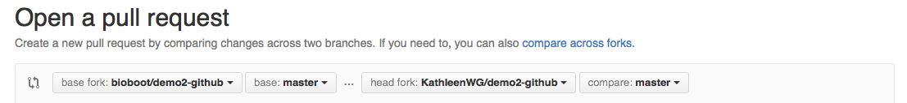

# 326.621A Homework 2

### Due October 28, 2018 @ 11:59PM

## Overview

In this homework, we will explore different way to collaborate with others through GitHub.


## 1. Exploring the [Homework Repo](https://github.com/snu-stat/stat326_621a-2018-hw2)

- At the education server, first make sure you are in a suitable working directory, e.g. 
```
    cd
    mkdir homework
    cd homework
    mkdir hw2
    cd hw2
```

- Clone the [homework repo](https://github.com/snu-stat/stat326_621a-2018-hw2) to the working directory you just have created.

- Then `cd stat326_621a-2018-hw2/` and use your command line knowledge of git to inspect history (`git log`), contributors (`git blame`) and differences (`git diff`).

- Now browse the online version of this same repo on the website of [GitHub](https://github.com/snu-stat/stat326_621a-2018-hw2).


## 2. Collaborating on GitHub

There are two basic models for collaborating on GitHub. 
These are known as the **Shared repository model** and the **Fork & pull model** (often just referred to as **Pull requests**).


1. The **shared repository model** is more prevalent with small teams and organizations collaborating on private projects. Everyone is granted **push** access to a single shared repository and different branches are primarily used to isolate major changes whilst small changes typically get pushed directly to the default **master** branch as you have already done in class.


2. The **fork & pull model** lets _anyone_ fork an existing repository and push changes to their personal fork _without requiring access be granted_ to the source repository. The changes must then be pulled into the source repository by the project maintainer. This model reduces the amount of friction for new contributors and is very popular with open source projects because it allows people to work independently without upfront coordination.


You already have a clone of the homework repo on your local machine from step 1 above that you can modify locally and also use `git pull origin master` to sync with any subsequent changes in the original GitHub repo. **However, you don't have permissions to actually `push` your changes to this original GitHub repo**. Go ahead and try if you like...

> Note: If you were added as a 'collaborator' on the repo then you would be able to **git push origin master**, in the same way you did for your own repo in class, and contribute your changes directly. This is simply the **shared repository model** and you can create your own by adding 'collaborators' to your own GitHub repos under the *Settings* link. For now we focus on the more complicated but common **fork and pull** approach. 


Below we will explore the **fork & pull** approach as it can be used with any public repo on GitHub.


## 3. Fork and pull

To get your changes incorporated into someone else's repo that you are *not* an official collaborator on requires us to first **fork** the original repo, then **clone** it to your local computer, make and commit your changes and finally submit something called a **pull request**.

Like many things in the computing world this sounds more complicated than it really is so lets start by **forking** this repo -- All this does is create a completely separate copy of the repo under **YOUR** GitHub account.

- To do this click the **Fork** button towards the very top right of the [ORIGINAL](https://github.com/snu-stat/stat326_621a-2018-hw2) GitHub repo 


- Now after a short time you should be taken to a new webpage displaying your OWN fork (i.e. your personal copy) of the repo under your GitHub account.

- Examine this forked repo. It should look excately the same as the origional but with the subtle "forked from snu-stat/stat326_621a-2018-hw2" note under the title.

- We will now clone this forked repo to your local computer by using the link provided from clicking the somewhat obscure **copy icon** (see image below for an example of the clipboard like icon GitHub like to use).


-  When cloning on your computer this time, add a different destination name of **"myForkedCopy"** after the https address so as to help avoid potential confusion with the repo from step one above.

- Now, you have a local clone of the forked repo on your computer in a new directory named **myForkedCopy**.

- Let's `cd` into this directory and edit the file **COMMENTS.md** with `vi` or other means to add your name and a comment (see below). 

```
    cd myForkedCopy
    #echo '**won-j**:  Git and GitHub has a steep learning curve' >> COMMENTS.md
```

For example, add YOUR name in bold (i.e. surrounded by two starts on either side) and one thing that was not completely clear from the classes thus far (e.g. "staging area", "remote repos" or "한글도 되네요?").


- Once you have edited your file in `vi` go through the regular **git add/commit/push** steps, as we did in class.

- Check that your changes are on-line in YOUR GitHub forked copy.

- Do a final check that your repo is up-to-date with the original repo from which you forked by doing a regular git pull but directed to the origional repo. (Hint: you may need to add another remote repo to do this.)

- Now on YOUR GitHub forked copy click the little green **New pull request** button toward the top left of the page. This looks a bit like a small icon that has the two little curved white arrows (see below).


- On the subsequent **Comparing changes** page you may need to select the **base fork** as `snu-stat/stat326_621a-2018-hw2` (this is the original repo) and the **head fork** as your **YourUserName/stat326_621a-2018-hw2** (YOUR forked repo with your committed change). 

  

- Typically, however you will not need to change settings and will see a note saying that **These branches can be automatically merged**. 

Click the large **Create pull request** button (see below)


- Add a note describing your changes such as "COMMENTS.md changes from fork" and click the final **Create pull request** button to submit your changes for review to the original repo.


That's it, you can leave this page as your changes have been sent to the original package maintainers (basically everyone who has push access to the original repo). 


## 4. Congratulations

Congratulations! You have just contributed to this open source project ;)


