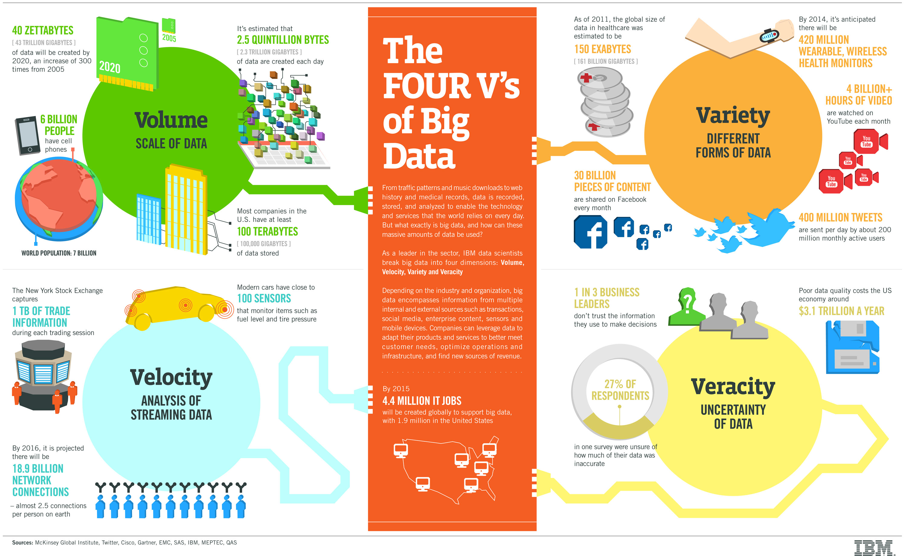

$\DeclareMathOperator*{\argmin}{arg\,min}$

## Acknowledgment

This lecture note is based on [Dr. Hua Zhou](http://hua-zhou.github.io)'s 2018 Winter Statistical Computing course notes available at <http://hua-zhou.github.io/teaching/biostatm280-2018winter/index.html>.

# What is this course about?

## Statistics and data science

- This course introduces some computing skills and software tools for handling potentially big data.

- Statistics, the science of _data analysis_, is the applied mathematics in the 21st century.

- Data is increasing in [volume, velocity, and variety](http://www.forbes.com/sites/oreillymedia/2012/01/19/volume-velocity-variety-what-you-need-to-know-about-big-data/).

## Classification of data sets by @Huber94HugeData; -@Huber96MassiveData {.smaller}

| Data Size | Bytes          | Storage Mode               |
|-----------|----------------|----------------------------|
| tiny      | $10^2$         | piece of paper             |
| small     | $10^4$         | a few pieces of paper      |
| medium    | $10^6$ (MB)    | a floppy disk              |
| large     | $10^8$         | hard disk                  |
| huge      | $10^9$ (GB)    | hard disk(s)               |
| massive   | $10^{12}$ (TB) | hard disk(s); RAID storage |

## Four V's of big data

  

Source: [IBM](http://www.ibmbigdatahub.com/infographic/four-vs-big-data).

## Course desciption

- This course introduces some computing skills and software tools for handling potentially big data.

- Read [syllabus](../..) for a tentative list of topics and course logistics.

## References

