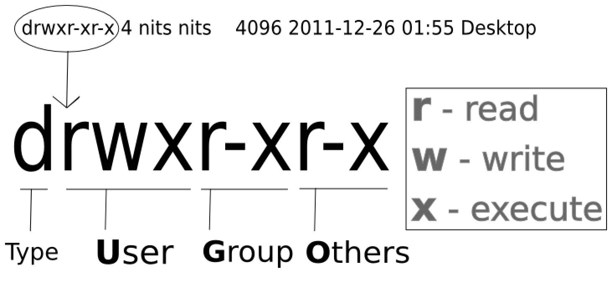
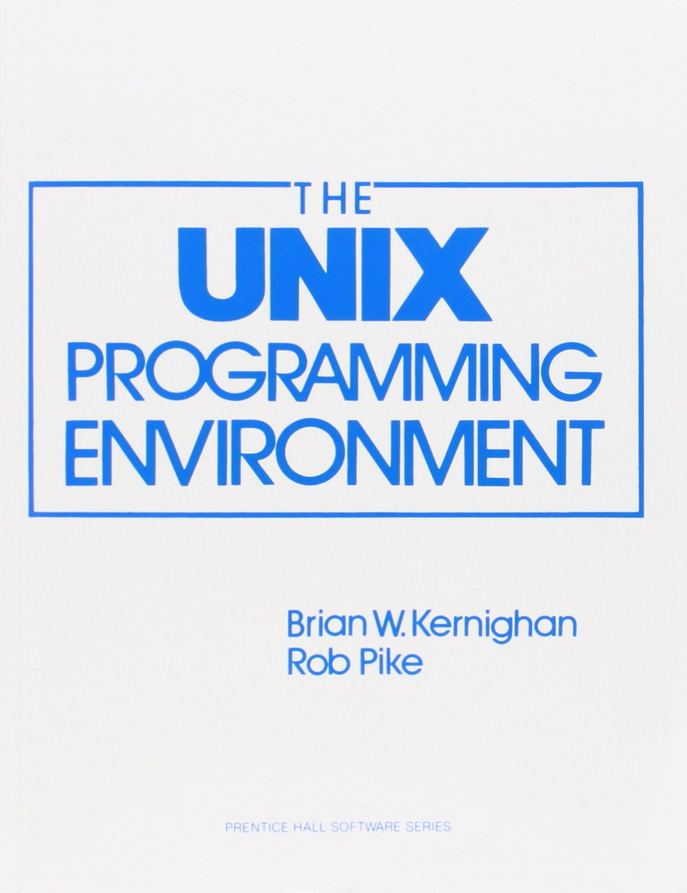

## Acknowledgment

This lecture note is based on [Dr. Hua Zhou](http://hua-zhou.github.io)'s 2018 Winter Statistical Computing course notes available at <http://hua-zhou.github.io/teaching/biostatm280-2018winter/index.html>.

## Unix

[Brief history](https://opensource.com/article/18/5/differences-between-linux-and-unix)

## Unix-like OSes

- Linux: led by [Linus Torvalds](http://en.wikipedia.org/wiki/Linus_Torvalds). Does not share kernel code base with original Unixes. 
- macOS (since OS X): built on top of another open-source OS called Darwin, derived from FreeBSD Unix. It is POSIX compliant. Most shell commands we review here apply to Mac OS terminal as well. Beware that macOS file system is case-insensitive by default (legacy from Mac OS ver < 10.x.x)
- Windows/DOS, unfortunately, is a totally different breed (Windows 10, though, possesses the Windows Subsystem for Linux.)

## [The Unix Philosophy](https://en.wikipedia.org/wiki/Unix_philosophy)

> Write programs that do one thing and do it well. Write programs to work together and that encourage open standards. Write programs to handle text streams, because that is a universal interface.
> 
> - Doug McIlory, the Bell System Technical Journal (1978)

### Modularity

- The Unix shell (we'll learn about this shortly) was designed to allow users to easily build complex workflows by interfacing smaller modular programs together.
    *  `wget | awk | grep | sort | uniq | plot`
    
- An alternative approach is to write a single complex program that takes raw data as input, and after hours of data processing, outputs publication figures and a final table of results.


## Why Linux

Linux is _the_ most common platform for scientific computing.

- Open source and community support.

- Things break; when they break using Linux, it's easy to fix.

- Scalability: portable devices (Android, iOS), laptops, servers, clusters, and super computers.
    - e.g. We'll see how to do distributed data analysis on a cluster running on Linux.

- Cost: it's free!

## [Distributions of Linux](http://upload.wikimedia.org/wikipedia/commons/1/1b/Linux_Distribution_Timeline.svg)

- Debian/Ubuntu is a popular choice for personal computers.

- RHEL/CentOS is popular on servers.

- The teaching servers for this class run CentOS 7.

# Enter Linux

```{r echo = FALSE, out.width = "90%"}
 
```

Source: <https://uproxx.com/movies/enter-the-draon-trivia/>

- On Linux or Mac, access the teaching server by
    ```{bash, eval=FALSE}
    ssh username@your-teaching-server-name-or-ip-address
    ```
    * The server addresses and usernames are provided in class.

- Windows machines need the [PuTTY](http://www.putty.org) program (free).

- Once you log in, change your password:
    ```{bash, eval=FALSE}
    passwd
    ```

- Show distribution/version on Linux:
    ```{bash, eval=FALSE}
    cat /etc/*-release
    ```
    ```
    CentOS Linux release 7.5.1804 (Core)
NAME="CentOS Linux"
VERSION="7 (Core)"
ID="centos"
ID_LIKE="rhel fedora"
VERSION_ID="7"
PRETTY_NAME="CentOS Linux 7 (Core)"
ANSI_COLOR="0;31"
CPE_NAME="cpe:/o:centos:centos:7"
HOME_URL="https://www.centos.org/"
BUG_REPORT_URL="https://bugs.centos.org/"
CENTOS_MANTISBT_PROJECT="CentOS-7"
CENTOS_MANTISBT_PROJECT_VERSION="7"
REDHAT_SUPPORT_PRODUCT="centos"
REDHAT_SUPPORT_PRODUCT_VERSION="7"
CentOS Linux release 7.5.1804 (Core)
CentOS Linux release 7.5.1804 (Core)
    ```

----

- Show distribution/version on Mac:
    ```{bash, eval=TRUE}
    sw_vers -productVersion
    ```
or
    ```{bash, eval=TRUE}
    system_profiler SPSoftwareDataType
    ```


# Linux shells

## What is a shell?

- A shell translates commands to OS instructions (similar to `cmd.exe` on Windows).

- Most commonly used shells include `bash`, `csh`, `tcsh`, `zsh`, etc.

- Sometimes a script or a command does not run simply because it's written for another shell.

- We mostly use `bash` shell commands in this class.

----

- Determine the current shell:
    ```{bash echo=TRUE}
    echo $SHELL
    ```

- List available shells:
    ```{bash}
    cat /etc/shells
    ```

----

- Change to another shell:
    ```{bash, eval=FALSE}
    exec bash -l
    ```
The `-l` option indicates it should be a login shell.

- Change your login shell permanently:
    ```{bash, eval=FALSE}
    chsh -s /bin/bash userid
    ```
Then log out and log in.

## Bash completion

Bash provides the following standard completion for the Linux users by default. Much less typing errors and time!  

- Pathname completion.  

- Filename completion.  

- Variablename completion: `echo $[TAB][TAB]`.  

- Username completion: `cd ~[TAB][TAB]`.

- Hostname completion `ssh username@[TAB][TAB]`.

- It can also be customized to auto-complete other stuff such as options and command's arguments. Google `bash completion` for more information.

# Navigating file system

## Linux directory structure

```{r echo = FALSE, out.width = "75%"}
 knitr::include_graphics("./linux_directory_structure.png")
```

- Upon log in, user is at his/her home directory.

## Move around the file system 

- `pwd` prints absolute path to the current working directory:
    ```{bash echo=TRUE}
    pwd
    ```

- `ls` lists contents of a directory:  
    ```{bash echo=TRUE}
    ls
    ```

- `ls -l` lists detailed contents of a directory:  
    ```{bash echo=TRUE}
    ls -l
    ```

- `ls -al` lists all contents of a directory, including those start with `.` (hidden folders):
    ```{bash echo=TRUE, small=TRUE}
    ls -al
    ```

----

- `..` denotes the parent of current working directory.

- `.` denotes the current working directory.

- `~` denotes user's home directory.

- `/` denotes the root directory.

- `cd ..` changes to parent directory.

- `cd` or `cd ~` changes to home directory.

- `cd /` changes to root directory.

<!-- 
- `pushd` changes the working directory but pushes the current directory into a stack.

- `popd` changes the working directory to the last directory added to the stack.
-->

## File permissions

```{r echo = FALSE, out.width = "75%"}
 
```

```{r echo = FALSE, out.width = "50%"}
 knitr::include_graphics("./linux_filepermission_oct.png")
```

----

- `chmod g+x file` makes a file executable to group members.

- `chmod 751 file` sets permission `rwxr-x--x` to a file.

- `groups userid` shows which group(s) a user belongs to:
    ```{bash}
    groups jhwon
    ```

## Manipulate files and directories

- `cp` copies file to a new location.

- `mv` moves file to a new location.

- `touch` creates a text file; if file already exists, it's left unchanged.

- `rm` deletes a file.

- `mkdir` creates a new directory.

- `rmdir` deletes an _empty_ directory.

- `rm -rf` deletes a directory and all contents in that directory (be cautious using the `-f` option ...).

## Find files {.smaller}

- `locate` locates a file by name:
    ```{bash, eval=FALSE}
    locate .bashrc
    ```
    ```
## /etc/skel/.bashrc
## /home/compstat/.bashrc
    ```

- `which` locates a program:
    ```{bash}
    which R
    ```

----

- `find` is similar to `locate` but has more functionalities, e.g., select files by age, size, permissions, .... , and is ubiquitous.
    ```{bash}
    find linux1.Rmd
    ```
    or
    ```{bash, eval=FALSE}
    find ~ -name linux1.Rmd
    ```

## Wildcard characters 

| Wildcard   | Matches                             |
|------------|-------------------------------------|
| `?`        | any single character                |
| `*`        | any character 0 or more times       |
| `+`        | one or more preceding pattern       |
| `^`        | beginning of the line               |
| `$`        | end of the line                     |
| `[set]`    | any character in set                |
| `[!set]`   | any character not in set            |
| `[a-z]`    | any lowercase letter                |
| `[0-9]`    | any number (same as `[0123456789]`) |


-
    ```{bash}
    # all png files in current folder
    ls -l *.png
    ```

## Regular expression

- Wildcards are examples of _regular expressions_. 

- Regular expressions are a powerful tool to efficiently sift through large amounts of text: record linking, data cleaning, scraping data from website or other data-feed. 

- Simple regular expressions
    * `^`: start of the string
    * `$`: end of the string
    * `?`: 0 or 1 repetition
    * `+`: 1 or more repetitions
    * `*`: 0 or more repetitions

- Google `regular expressions` to learn.


# Reference

```{r echo = FALSE, out.width = "40%"}
 
```

Source: [Amazon](https://www.amazon.co.uk/UNIX-Programming-Environment-Prentice-Hall-Software/dp/013937681X)


- Old, but still relevant

