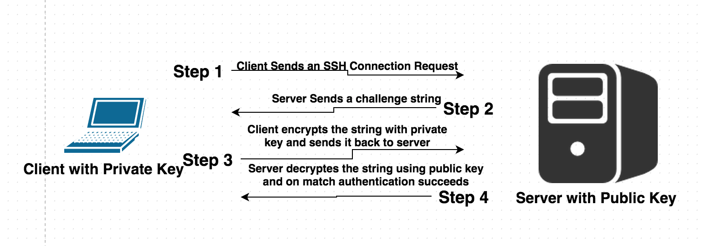

## Acknowledgment

This lecture note is based on [Dr. Hua Zhou](http://hua-zhou.github.io)'s 2018 Winter Statistical Computing course notes available at <http://hua-zhou.github.io/teaching/biostatm280-2018winter/index.html>.

# Working with text files

## View/peek text files

- `cat` prints the contents of a file:
    ```{bash, size='smallsize'}
    cat ~/.bash_profile
    ```

----

- `head -l` prints the first $l$ lines of a file:
    ```{bash}
    head -20 linux2.Rmd
    ```

----

- `tail -l` prints the last $l$ lines of a file:
    ```{bash}
    tail -20 linux2.Rmd
    ```

## `less` is more; `more` is less

- `more` browses a text file screen by screen (only downwards). Scroll down one page (paging) by pressing the spacebar; exit by pressing the `q` key.

- `less` is also a pager, but has more functionalities, e.g., scroll upwards and downwards through the input.

- `less` doesn't need to read the whole file, i.e., it loads files faster than `more`.

## `grep`

`grep` prints lines that match an expression:

- Show lines that contain string `CentOS`:
    ```{bash echo=TRUE}
    # quotes not necessary if not a regular expression
    grep 'CentOS' linux2.Rmd
    ```

----

- Search multiple text files:
    ```{bash echo=TRUE}
    grep 'CentOS' *.Rmd
    ```

----

- Show matching line numbers:
    ```{bash}
    grep -n 'CentOS' linux2.Rmd
    ```

----

- Find all files in current directory with `.png` extension:
    ```{bash}
    ls | grep '\.png$'
    ```

- Find all directories in the current directory:
    ```{bash}
    ls -al | grep '^d'
    ```

## `sed`

- `sed` is a stream editor.

- Replace `CentOS` by `RHEL` in a text file:
    ```{bash}
    sed 's/CentOS/RHEL/' linux2.Rmd | grep RHEL
    ```

## `awk`

- `awk` is a filter and report writer.

- Print sorted list of login names:
    ```{bash}
    awk -F: '{ print $1 }' /etc/passwd | sort | head -5
    ```

----
    
- Print number of lines in a file, as `NR` stands for Number of Rows:
    ```{bash}
    awk 'END { print NR }' /etc/passwd
    ```
or
    ```{bash}
    wc -l /etc/passwd
    ```
or
    ```{bash}
    wc -l < /etc/passwd
    ```

----

- Print login names with UID in range `1000-1035`:
    ```{bash}
    awk -F: '{if ($3 >= 1000 && $3 <= 1035) print}' /etc/passwd
    ```
    
- Print login names and log-in shells in comma-seperated format:
    ```{bash}
    awk -F: '{OFS = ","} {print $1, $7}' /etc/passwd
    ```

----

- Print login names and indicate those with UID>1000 as `vip`:
    ```{bash}
    awk -F: -v status="" '{OFS = ","} 
    {if ($3 >= 1000) status="vip"; else status="regular"} 
    {print $1, status}' /etc/passwd
    ```

## Piping and redirection

- `|` sends output from one command as input of another command.

- `>` directs output from one command to a file.

- `>>` appends output from one command to a file.

- `<` reads input from a file.

- Combinations of shell commands (`grep`, `sed`, `awk`, ...), piping and redirection, and regular expressions allow us pre-process and reformat huge text files efficiently. 


## Text editors

```{r echo = FALSE, out.width = "35%"}
 knitr::include_graphics("./Richard_Stallman_2013.png")
```

Source: [Editor War](http://en.wikipedia.org/wiki/Editor_war) on Wikipedia.

## Emacs

- `Emacs` is a powerful text editor with extensive support for many languages including `R`, $\LaTeX$, `python`, and `C/C++`; however it's _not_ installed by default on many Linux distributions. 

- Basic survival commands:
    - `emacs filename` to open a file with emacs.  
    - `CTRL-x CTRL-f` to open an existing or new file.  
    - `CTRL-x CTRX-s` to save.  
    - `CTRL-x CTRL-w` to save as.  
    - `CTRL-x CTRL-c` to quit.

----

- Google `emacs cheatsheet`


<p align="center">
  
</p>


`C-<key>` means hold the `control` key, and press `<key>`.  
`M-<key>` means press the `Esc` key once, and press `<key>`.

## vi

- `vi` is ubiquitous (POSIX standard). Learn at least its basics; otherwise you can edit nothing on some clusters. 

- Basic survival commands:
    - `vi filename` to start editing a file.
    - `vi` is a _modal_ editor: _insert_ mode and _normal_ mode. Pressing `i` switches from the normal mode to insert mode. Pressing `ESC` switches from the insert mode to normal mode.  
    - `:x<Return>` quits `vi` and saves changes.  
    - `:q!<Return>` quits vi without saving latest changes.  
    - `:w<Return>` saves changes.
    - `:wq<Return>` quits `vi` and saves changes.      

----

- Google `vi cheatsheet`

<p align="center">
  
</p>

# Line breaks in text files

- Windows uses a pair of `CR` and `LF` for line breaks. 

- Linux/Unix uses an `LF` character only. 

- macOS X also uses a single `LF` character. But old Mac OS used a single `CR` character for line breaks. 

- If transferred in binary mode (bit by bit) between OSs, a text file could look a mess. 

- Most transfer programs automatically switch to text mode when transferring text files and perform conversion of line breaks between different OSs.


# Processes

## Processes

- OS runs processes on behalf of user.

- Each process has Process ID (PID), Username (UID), Parent process ID (PPID), Time and data process started (STIME), time running (TIME), etc.

    ```{bash}
    ps
    ```

----

- All current running processes:
    ```{bash}
    ps -eaf | head 
    ```

----

- All Python processes:
    ```{bash}
    ps -eaf | grep python | tail -3
    ```

- Process with PID=1:
    ```{bash}
    ps -fp 1
    ```

----

- All processes owned by a user:
    ```{bash}
    ps -fu jhwon | head
    ```

## Kill processes

- Kill process with PID=1001:
    ```{bash, eval=FALSE}
    kill 1001
    ```

- Kill all R processes.
    ```{bash, eval=FALSE}
    killall -r R
    ```

## `top`

- `top` prints realtime process information (very useful).
    ```{bash, eval=FALSE}
    top
    ```
    
    ```{r echo = FALSE, out.width = "75%"}
 
    ```

# Secure shell (SSH)

## SSH

SSH (secure shell) is the dominant cryptographic network protocol for secure network connection via an insecure network.

- Recall
    ```{bash, eval=FALSE}
    ssh username@your-teaching-server-name-or-ip-address
    ```


## Use keys over password

- Key authentication is more secure than password. Most passwords are weak.

- Scripts or programs may need to systematically SSH into other machines.

- Log into multiple machines using the same key.

- Seamless use of many services: Git, svn, Amazon EC2 cloud service, parallel computing on multiple hosts, etc.

- Many servers only allow key authentication and do not accept password authentication.

## Key authentication

```{r echo = FALSE, out.width = "85%"}
knitr::include_graphics("./key_authentication_1.png")
```

```{r echo = FALSE, out.width = "85%"}

```

----

- _Public key_. Put on the machine(s) you want to log in.

- _Private key_. Put on your own computer. Consider this as the actual key in your pocket; never give to others.

- Messages from server to your computer is encrypted with your public key. It can only be decrypted using your private key.

- Messages from your computer to server is signed with your private key (digital signatures) and can be verified by anyone who has your public key (authentication).

## Steps for generating keys {.smaller}

- On Linux or Mac, to generate a key pair:
    ```{bash, eval=FALSE}
    ssh-keygen -t rsa -f ~/.ssh/[KEY_FILENAME] -C [USERNAME]
    ```   
    - `[KEY_FILENAME]` is the name that you want to use for your SSH key files. 
    Without the `-f` option, `ssh-keygen` generates a private key file `id_rsa`  and  a public key file `id_rsa.pub` in `~/.ssh`, where `~` refers to your home directory.
    If the filename, e.g., `my-ssh-key`, is provided, then  
    the private key file will be `~/.ssh/my-ssh-key` and the public key file will be `~/.ssh/my-ssh-key.pub`. In this case, you need to explicitly reference the key in the `ssh` command:
        ```{bash, eval=FALSE}
ssh user@server -i ~/.ssh/my-ssh-key
        ```
        or use a configuration file, `~/.ssh/config` like
        ```
    Host your-teaching-server-name-or-ip-address
        IdentityFile ~/.ssh/my-ssh-key
        ```
    
    - `[USERNAME]` is the user for whom you will apply this SSH key. Optional.
    
    - Use a (optional) paraphrase different from your password.  
    
- Set correct permissions on the `.ssh` folder and key files
    ```{bash, eval=FALSE}
    chmod 400 ~/.ssh/[KEY_FILENAME]
    ```

----

- Append the public key to the `~/.ssh/authorized_keys` file of any Linux machine we want to SSH to, e.g.,
    ```{bash, eval=FALSE}
    ssh-copy-id -i ~/.ssh/[KEY_FILENAME] username@your-teaching-server-name-or-ip-address
    ```

- Test your new key.
    ```{bash, eval=FALSE}
    ssh -i ~/.ssh/[KEY_FILENAME] username@your-teaching-server-name-or-ip-address
    ```
    
- If it still asks the password, log on and change file permisions and try again:
    ```{bash, eval=FALSE}
    chmod 0700 ~/.ssh
    chmod 600 ~/.ssh/authorized_keys
    ```

- Now you don't need password each time you connect from your machine to the teaching server.

----

- If you set paraphrase when generating keys, you'll be prompted for the paraphrase each time the private key is used. Avoid repeatedly entering the paraphrase by using `ssh-agent` on Linux/Mac or Pagent on Windows.

- Same key pair can be used between any two machines. We don't need to regenerate keys for each new connection.

- For Windows users, the private key generated by `ssh-keygen` cannot be directly used by PuTTY; use PuTTYgen for conversion. Then let PuTTYgen use the converted private key. Read [tutorial](https://www.digitalocean.com/community/tutorials/how-to-create-ssh-keys-with-putty-to-connect-to-a-vps).

## Transfer files between machines

- `scp` securely transfers files between machines using SSH.
    ```{bash, eval=FALSE}
    ## copy file from local to remote
    scp localfile username@your-teaching-server-name-or-ip-address:/pathtofolder
    ```
    ```{bash, eval=FALSE}
    ## copy file from remote to local
    scp username@your-teaching-server-name-or-ip-address:/pathtofile pathtolocalfolder
    ```

- `sftp` means the File Transfer Protocol via SSH.

- GUIs for Windows (WinSCP) or Mac (Cyberduck).

- (My preferred way) Use a **version control system** to sync project files between different machines and systems.


# Running R in Linux

## Interactive mode

- Start R in the interactive mode by typing `R` in shell.

- Then run R script by
    ```{r, eval=FALSE}
    source("script.R")
    ```

## Batch mode {.smaller}

- Demo script [`meanEst.R`](./meanEst.R) implements an (terrible) estimator of mean
$$
  {\widehat \mu}_n = \frac{\sum_{i=1}^n x_i 1_{x_i \text{ is prime}}}{\sum_{i=1}^n 1_{x_i \text{ is prime}}}.
$$
    ```{bash, echo=FALSE}
    cat meanEst.R
    ```

----

- To run your R code non-interactively aka in batch mode, we have at least two options:
    ```{bash, eval=FALSE}
    # default output to meanEst.Rout
    R CMD BATCH meanEst.R
    ```
or
    ```{bash, eval=FALSE}
    # output to stdout
    Rscript meanEst.R
    ```

- Typically automate batch calls using a scripting language, e.g., Python, perl, and shell script.

## Pass arguments to R scripts

- Specify arguments in `R CMD BATCH`:
    ```{bash, eval=FALSE}
    R CMD BATCH '--args mu=1 sig=2 kap=3' script.R
    ```

- Specify arguments in `Rscript`:
    ```{bash, eval=FALSE}
    Rscript script.R mu=1 sig=2 kap=3
    ```

- Parse command line arguments using magic formula
    ```{r, eval=FALSE}
    for (arg in commandArgs(T)) {
      eval(parse(text=arg))
    }
    ```
in R script. After calling the above code, all command line arguments will be available in the global namespace.

---- 

- To understand the magic formula `commandArgs`, run R by:
    ```{bash, eval=FALSE}
    R '--args mu=1 sig=2 kap=3'
    ```
and then issue commands in R
    ```{r, eval=FALSE}
    commandArgs()
    commandArgs(TRUE)
    ```

----

- Understand the magic formula `parse` and `eval`:
    ```{r, error=TRUE}
    rm(list=ls())
    print(x)
    parse(text="x=3")
    eval(parse(text="x=3"))
    print(x)
    ```

- [`runSim.R`](./runSim.R) has components: (1) method implementation, (2) data generator with unspecified parameter `n`, (3) estimation based on generated data, and (4) **command argument parser**.
    ```{bash, echo=FALSE}
    cat runSim.R
    ```

----

- Call `runSim.R` with sample size `n=100`:
    ```{bash}
    R CMD BATCH '--args n=100' runSim.R
    ```
or
    ```{bash}
    Rscript runSim.R n=100
    ```

## Run long jobs

- Many statistical computing tasks take long: simulation, MCMC, etc.

### `nohup`

- `nohup` command in Linux runs program(s) immune to hangups and writes output to `nohup.out` by default. Logging out will _not_ kill the process; we can log in later to check status and results.

- `nohup` is POSIX standard thus available on Linux and MacOS.

- Run `runSim.R` in background and writes output to `nohup.out`:
    ```{bash}
    nohup Rscript runSim.R n=100 &
    ```

### `screen`

- `screen` is another popular utility, but not installed by default. 

- Typical workflow using `screen`.

    0. Access remote server using `ssh`.

    0. Start jobs in batch mode.

    0. Detach jobs.

    0. Exit from server, wait for jobs to finish.

    0. Access remote server using `ssh`.

    0. Re-attach jobs, check on progress, get results, etc.

## Use R to call R

R in conjuction with `nohup` or `screen` can be used to orchestrate a large simulation study.

- It can be more elegant, transparent, and robust to parallelize jobs corresponding to different scenarios (e.g., different generative models) outside of the code used to do statistical computation.

- We consider a simulation study in R but the same approach could be used with code written in Julia, Matlab, Python, etc.

- Python in many ways makes a better _glue_; we may discuss this later in the course.

- Suppose we have 
    - [`runSim.R`](http://hua-zhou.github.io/teaching/biostatm280-2018winter/slides/02-linux/runSim.R) which runs a simulation based on command line argument `n`.  
    - A large collection of `n` values that we want to use in our simulation study.  
    - Access to a server with 128 cores.  
    
- Option 1: manually call `runSim.R` for each setting.

- Option 2: automate calls using R and `nohup`. [autoSim.R](http://hua-zhou.github.io/teaching/biostatm280-2018winter/slides/02-linux/autoSim.R)

-
    ```{bash}
    cat autoSim.R
    ```

-
    ```{bash}
    Rscript autoSim.R
    ```

    ```{bash, echo=FALSE, eval=TRUE}
    rm n*.txt *.Rout
    ```
    
- Now we just need write a script to collect results from the output files.