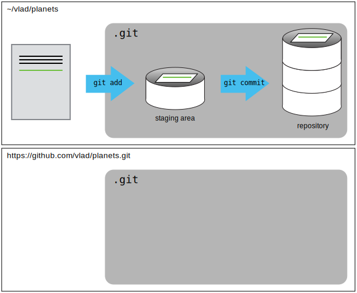
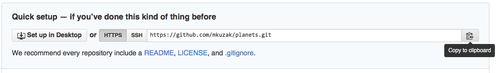
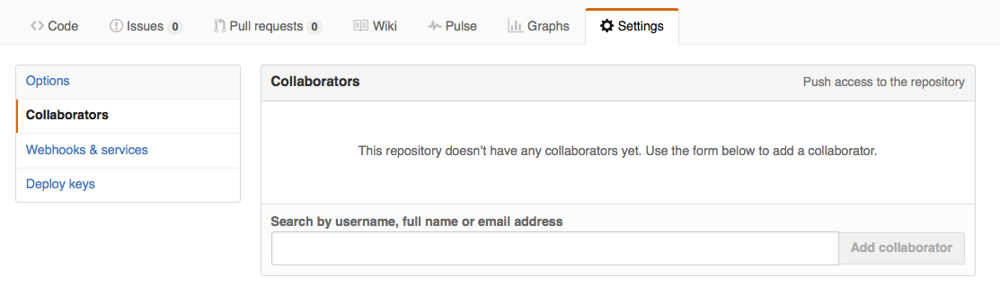

## Acknowledgment

This lecture note is based on 

Daisie Huang and Ivan Gonzalez (eds): "Software Carpentry: Version Control with Git."  Version 2016.06, June 2016,
<https://github.com/swcarpentry/git-novice>, 10.5281/zenodo.57467.


# Automated Version Control

## Motivating Example


Wolfman and Dracula have been hired by Universal Missions (a space
services spinoff from Euphoric State University) to investigate if it
is possible to send their next planetary lander to Mars.  They want to
be able to work on the plans at the same time, but they have run into
problems doing this in the past.  If they take turns, each one will
spend a lot of time waiting for the other to finish, but if they work
on their own copies and email changes back and forth things will be
lost, overwritten, or duplicated.

A colleague suggests using **version control** to
manage their work. Version control is better than mailing files back and forth:

*   Nothing that is committed to version control is ever lost, unless
    you work really, really hard at it. Since all old versions of
    files are saved, it's always possible to go back in time to see
    exactly who wrote what on a particular day, or what version of a
    program was used to generate a particular set of results.

*   As we have this record of who made what changes when, we know who to ask
    if we have questions later on, and, if needed, revert to a previous
    version, much like the "undo" feature in an editor.

*   When several people collaborate in the same project, it's possible to
    accidentally overlook or overwrite someone's changes. The version control
    system automatically notifies users whenever there's a conflict between one
    person's work and another's.

Teams are not the only ones to benefit from version control: lone
researchers can benefit immensely (*future-you*!).  Keeping a record of what was
changed, when, and why is extremely useful for all researchers if they
ever need to come back to the project later on (e.g., a year later,
when memory has faded).


## Version Control System


- Version control system keeps track of these changes for us,
- effectively creating different versions of our files. 
- It allows us to decide which changes will be made to the next version (each record of these changes is called a
**commit**
- Complete history of commits for a particular project and their metadata make up
a **repository**
- Repositories can be kept in sync across different computers, facilitating collaboration among different people.
- Version control is like an unlimited 'undo'.

## The Long History of Version Control Systems

- Automated version control systems like RCS, CVS, or Subversion have been around since the early 1980s.
- But they need a centralized server to host the repository.
- More modern systems, such as Git are *distributed*. 
- These modern systems also include powerful merging tools that make it possible for multiple authors to work on the same files concurrently.

## Paper Writing

* Imagine you drafted an excellent paragraph for a paper you are writing, but later ruin it. How would you retrieve the *excellent* version of your conclusion? Is it even possible?
* Imagine you have 5 co-authors. How would you manage the changes and comments they make to your paper? If you use Microsoft Word, what happens if you accept changes made using the `Track Changes` option? Do you have a history of those changes?

# Setting Up Git

## Configuring `git` 

When we use Git on a new computer for the first time, we need to configure a few things:

*   our name and email address (recommended)
*   what our preferred text editor is (optional),
*   and that we want to use these settings globally (i.e. for every project).

On a command line, Git commands are written as `git verb options`:

~~~
$ git config --global user.name "Vlad Dracula"
$ git config --global user.email "vlad@tran.sylvan.ia"
~~~

(Use your own name and email address instead of Dracula's.) 

This user name and email will be associated with your subsequent Git activity.

Since we will be interacting with [GitHub](https://github.com/), the email address should be the same as the one used when setting up your GitHub account.  

If you are concerned about privacy, please review [GitHub's instructions for keeping your email address private](https://help.github.com/articles/setting-your-commit-email-address-on-github).  If you elect to use a private email address with GitHub, then use that same email address for the `user.email` value, e.g. `username@users.noreply.github.com` replacing `username` with your GitHub one. 

Dracula may also want to set his favorite text editor:

~~~
$ git config --global core.editor "emacs"
~~~

(In most Unix systems, the defaut is `vi`.)

You can check your settings at any time:

~~~
$ git config --list
~~~

You can change your configuration as many times as you want.


## Git Help and Manual

~~~
$ git config -h
$ git config --help
~~~


# Creating a Repository

Create a directory in your home directory and then move into that directory:

~~~
$ cd
$ mkdir planets
$ cd planets
~~~

Tell Git to make `planets` a repository:

~~~
$ git init
~~~

- `git init` will create a repository that
includes subdirectories and their files---there is no need to create
separate repositories nested within the `planets` repository, whether
subdirectories are present from the beginning or added later. 
- Also, note that the creation of the `planets` directory and its initialization as a
repository are completely separate processes.

## Hidden directory `.git`

~~~
$ ls -a
~~~

~~~
.	..	.git
~~~

- Git uses this special sub-directory to store all the information about the project, including all files and sub-directories located within the project's directory.
- If we ever delete the `.git` sub-directory, we will lose the project's history.

## Status of the project

~~~
$ git status
~~~

~~~
# On branch master
#
# Initial commit
#
nothing to commit (create/copy files and use "git add" to track)
~~~


### Don't do this:

~~~
$ cd ~/Desktop   # return to Desktop directory
$ cd planets     # go into planets directory, which is already a Git repository
$ ls -a          # ensure the .git sub-directory is still present in the planets directory
$ mkdir moons    # make a sub-directory planets/moons
$ cd moons       # go into moons sub-directory
$ git init       # make the moons sub-directory a Git repository
$ ls -a          # ensure the .git sub-directory is present indicating we have created a new Git repository
~~~

# Tracking Changes

## Modify-Add-Commit Cycle 

First let's make sure we're still in the right directory:

~~~
$ pwd
~~~

~~~
/home/vlad/Desktop/planets
~~~

Create a file called `mars.txt` that contains some notes about the Red Planet’s suitability as a base.:

~~~
$ echo 'Cold and dry, but everything is my favorite color' > mars.txt
~~~

`mars.txt` now contains a single line, which we can see by running:

~~~
$ cat mars.txt
~~~

~~~
Cold and dry, but everything is my favorite color
~~~

Check the status of our project again:

~~~
$ git status
~~~

~~~
On branch master

Initial commit

Untracked files:
   (use "git add <file>..." to include in what will be committed)

	mars.txt
nothing added to commit but untracked files present (use "git add" to track)
~~~

The "untracked files" message means that there's a file in the directory
that Git isn't keeping track of.
We can tell Git to track a file using `git add`:

~~~
$ git add mars.txt
~~~

~~~
$ git status
~~~

~~~
On branch master

Initial commit

Changes to be committed:
  (use "git rm --cached <file>..." to unstage)

	new file:   mars.txt

~~~

Git now knows that it's supposed to keep track of `mars.txt`,
but it hasn't recorded these changes as a commit yet.
To get it to do that,
we need to run one more command:

~~~
$ git commit -m "Start notes on Mars as a base"
~~~

~~~
[master (root-commit) f22b25e] Start notes on Mars as a base
 1 file changed, 1 insertion(+)
 create mode 100644 mars.txt
~~~

When we run `git commit`,
Git takes everything we have told it to save by using `git add`
and stores a copy permanently inside the special `.git` directory.
This permanent copy is called a *commit* and its short identifier is `f22b25e`.
Your commit may have another identifier.

We use the `-m` flag (for "message")
to record a short, descriptive, and specific comment that will help us remember later on what we did and why.
If we just run `git commit` without the `-m` option,
Git will launch an editor so that we can write a longer message.

[How to write a git commit message](https://chris.beams.io/posts/git-commit/)

~~~
$ git status
~~~

~~~
On branch master
nothing to commit, working directory clean
~~~

If we want to know what we've done recently,
we can ask Git to show us the project's history using `git log`:

~~~
$ git log
~~~

~~~
commit f22b25e3233b4645dabd0d81e651fe074bd8e73b
Author: Vlad Dracula <vlad@tran.sylvan.ia>
Date:   Thu Aug 22 09:51:46 2013 -0400

    Start notes on Mars as a base
~~~

`git log` lists all commits  made to a repository in reverse chronological order, including
- each commit's full identifier
- each commit's author,
- when each commitwas created,
- the log message Git was given when the commit was created.

## Where Are My Changes?

If we run `ls` at this point, we will still see just one file called `mars.txt`.
That's because Git saves information about files' history
in the special `.git` directory mentioned earlier
so that our filesystem doesn't become cluttered
(and so that we can't accidentally edit or delete an old version).

## Another Cycle

Now suppose Dracula adds more information to the file.

~~~
$ cat mars.txt
~~~

~~~
Cold and dry, but everything is my favorite color
The two moons may be a problem for Wolfman
~~~

~~~
$ git status
~~~

~~~
On branch master
Changes not staged for commit:
  (use "git add <file>..." to update what will be committed)
  (use "git checkout -- <file>..." to discard changes in working directory)

	modified:   mars.txt

no changes added to commit (use "git add" and/or "git commit -a")
~~~

Key phrase: *"no changes added to commit"*

We have changed this file,
but we haven't told Git we will want to save those changes
(which we do with `git add`)
nor have we saved them (which we do with `git commit`).

Review our changes:

~~~
$ git diff
~~~

~~~
diff --git a/mars.txt b/mars.txt
index df0654a..315bf3a 100644
--- a/mars.txt
+++ b/mars.txt
@@ -1 +1,2 @@
 Cold and dry, but everything is my favorite color
+The two moons may be a problem for Wolfman
~~~

The output is  actually a series of commands for tools like editors and `patch`.

Break it down into pieces:

1.  The first line tells us that Git is producing output similar to the Unix `diff` command
    comparing the old and new versions of the file.
2.  The second line tells exactly which versions of the file
    Git is comparing;
    `df0654a` and `315bf3a` are unique computer-generated labels for those versions.
3.  The third and fourth lines once again show the name of the file being changed.
4.  The remaining lines are the most interesting, they show us the actual differences
    and the lines on which they occur.
    In particular,
    the `+` marker in the first column shows where we added a line.

After reviewing our change, it's time to commit it:

~~~
$ git commit -m "Add concerns about effects of Mars' moons on Wolfman"
$ git status
~~~

~~~
On branch master
Changes not staged for commit:
  (use "git add <file>..." to update what will be committed)
  (use "git checkout -- <file>..." to discard changes in working directory)

	modified:   mars.txt

no changes added to commit (use "git add" and/or "git commit -a")
~~~

Git won't commit because we didn't use `git add` first.

~~~
$ git add mars.txt
$ git commit -m "Add concerns about effects of Mars' moons on Wolfman"
~~~

~~~
[master 34961b1] Add concerns about effects of Mars' moons on Wolfman
 1 file changed, 1 insertion(+)
~~~

## Staging

Git insists that we add files to the set we want to commit
before actually committing anything. 

This allows us to commit our changes in *stages* and capture changes in logical portions rather than only large batches.

### Example: paper writing 

Suppose we're adding a few citations to relevant research to our thesis.
We might want to commit those additions,
and the corresponding bibliography entries,
but *not* commit some of our work drafting the conclusion
(which we haven't finished yet).

To allow for this,
Git has a special *staging area*
where it keeps track of things that have been added to
the current **changeset** but not yet committed.

- `git add` specifies *what* will go in a snapshot (putting things in the staging area),
- `git commit` then *actually takes* the snapshot, and makes a permanent record of it (as a commit).


To see how our changes to a file move from our editor to the staging area and into long-term storage,
add another line to the file:

~~~
$ cat mars.txt
~~~

~~~
Cold and dry, but everything is my favorite color
The two moons may be a problem for Wolfman
But the Mummy will appreciate the lack of humidity
~~~

~~~
$ git diff
~~~

~~~
diff --git a/mars.txt b/mars.txt
index 315bf3a..b36abfd 100644
--- a/mars.txt
+++ b/mars.txt
@@ -1,2 +1,3 @@
 Cold and dry, but everything is my favorite color
 The two moons may be a problem for Wolfman
+But the Mummy will appreciate the lack of humidity
~~~

Put that change in the staging area and see what `git diff` reports:

~~~
$ git add mars.txt
$ git diff
~~~

There is no output, as expected.

However, if we do this:

~~~
$ git diff --staged
~~~

~~~
diff --git a/mars.txt b/mars.txt
index 315bf3a..b36abfd 100644
--- a/mars.txt
+++ b/mars.txt
@@ -1,2 +1,3 @@
 Cold and dry, but everything is my favorite color
 The two moons may be a problem for Wolfman
+But the Mummy will appreciate the lack of humidity
~~~

it shows us the difference between
the last committed change
and what's in the staging area.
Let's save our changes:

~~~
$ git commit -m "Discuss concerns about Mars' climate for Mummy"
~~~

~~~
[master 005937f] Discuss concerns about Mars' climate for Mummy
 1 file changed, 1 insertion(+)
~~~

check our status:

~~~
$ git status
~~~

~~~
On branch master
nothing to commit, working directory clean
~~~

and look at the history of what we've done so far:

~~~
$ git log
~~~

~~~
commit 005937fbe2a98fb83f0ade869025dc2636b4dad5
Author: Vlad Dracula <vlad@tran.sylvan.ia>
Date:   Thu Aug 22 10:14:07 2013 -0400

    Discuss concerns about Mars' climate for Mummy

commit 34961b159c27df3b475cfe4415d94a6d1fcd064d
Author: Vlad Dracula <vlad@tran.sylvan.ia>
Date:   Thu Aug 22 10:07:21 2013 -0400

    Add concerns about effects of Mars' moons on Wolfman

commit f22b25e3233b4645dabd0d81e651fe074bd8e73b
Author: Vlad Dracula <vlad@tran.sylvan.ia>
Date:   Thu Aug 22 09:51:46 2013 -0400

    Start notes on Mars as a base
~~~

## Directories

1. Try:

~~~
$ mkdir directory
$ git status
$ git add directory
$ git status
~~~

2. If you create a directory in your Git repository and populate it with files, you can add all files in the directory at once by:

~~~
git add <directory-with-files>
~~~

## Recap


## Author and Committer

~~~
$ git add me.txt
$ git commit -m "Update Vlad's bio." --author="Frank N. Stein <franky@monster.com>"
~~~

~~~
[master 4162a51] Update Vlad's bio.
Author: Frank N. Stein <franky@monster.com>
1 file changed, 2 insertions(+), 2 deletions(-)

$ git log --format=full
commit 4162a51b273ba799a9d395dd70c45d96dba4e2ff
Author: Frank N. Stein <franky@monster.com>
Commit: Vlad Dracula <vlad@tran.sylvan.ia>

Update Vlad's bio.

commit aaa3271e5e26f75f11892718e83a3e2743fab8ea
Author: Vlad Dracula <vlad@tran.sylvan.ia>
Commit: Vlad Dracula <vlad@tran.sylvan.ia>

Vlad's initial bio.
~~~


# Exploring History


## `HEAD` of a repository 

You can refer to the _most recent commit_ of the working
directory by using the identifier `HEAD`.

~~~
$ cat mars.txt
~~~

~~~
Cold and dry, but everything is my favorite color
The two moons may be a problem for Wolfman
But the Mummy will appreciate the lack of humidity
An ill-considered change
~~~

~~~
$ git diff HEAD mars.txt
~~~

~~~
diff --git a/mars.txt b/mars.txt
index b36abfd..0848c8d 100644
--- a/mars.txt
+++ b/mars.txt
@@ -1,3 +1,4 @@
 Cold and dry, but everything is my favorite color
 The two moons may be a problem for Wolfman
 But the Mummy will appreciate the lack of humidity
+An ill-considered change.
~~~

Same as 

~~~
$ git diff mars.txt
~~~

The real goodness is when you can refer to *previous commits*:  

~~~
$ git diff HEAD~1 mars.txt
~~~

~~~
$ git diff HEAD~2 mars.txt
~~~

~~~
diff --git a/mars.txt b/mars.txt
index df0654a..b36abfd 100644
--- a/mars.txt
+++ b/mars.txt
@@ -1 +1,4 @@
 Cold and dry, but everything is my favorite color
+The two moons may be a problem for Wolfman
+But the Mummy will appreciate the lack of humidity
+An ill-considered change
~~~

## Commit IDs

Recall:

~~~
$ git log
~~~

~~~
commit 005937fbe2a98fb83f0ade869025dc2636b4dad5
Author: Vlad Dracula <vlad@tran.sylvan.ia>
Date:   Thu Aug 22 10:14:07 2013 -0400

    Discuss concerns about Mars' climate for Mummy

commit 34961b159c27df3b475cfe4415d94a6d1fcd064d
Author: Vlad Dracula <vlad@tran.sylvan.ia>
Date:   Thu Aug 22 10:07:21 2013 -0400

    Add concerns about effects of Mars' moons on Wolfman

commit f22b25e3233b4645dabd0d81e651fe074bd8e73b
Author: Vlad Dracula <vlad@tran.sylvan.ia>
Date:   Thu Aug 22 09:51:46 2013 -0400

    Start notes on Mars as a base
~~~


Our first commit was given the unique ID
`f22b25e3233b4645dabd0d81e651fe074bd8e73b`:

~~~
$ git diff f22b25e3233b4645dabd0d81e651fe074bd8e73b mars.txt
~~~

or

~~~
$ git diff f22b25e mars.txt
~~~

~~~
diff --git a/mars.txt b/mars.txt
index df0654a..93a3e13 100644
--- a/mars.txt
+++ b/mars.txt
@@ -1 +1,4 @@
 Cold and dry, but everything is my favorite color
+The two moons may be a problem for Wolfman
+But the Mummy will appreciate the lack of humidity
+An ill-considered change
~~~

## Restoring older versions

~~~
$ cat mars.txt  # accidental overwrite
~~~

~~~
We will need to manufacture our own oxygen
~~~

~~~
$ git status
~~~

~~~
On branch master
Changes not staged for commit:
  (use "git add <file>..." to update what will be committed)
  (use "git checkout -- <file>..." to discard changes in working directory)

	modified:   mars.txt

no changes added to commit (use "git add" and/or "git commit -a")
~~~

Put things back by using `git checkout`:

~~~
$ git checkout HEAD mars.txt
$ cat mars.txt
~~~

~~~
Cold and dry, but everything is my favorite color
The two moons may be a problem for Wolfman
But the Mummy will appreciate the lack of humidity
~~~

If we want to go back even further,
we can use a commit ID instead:

~~~
$ git checkout f22b25e mars.txt
~~~

~~~
$ cat mars.txt
~~~

~~~
Cold and dry, but everything is my favorite color
~~~

~~~
$ git status
~~~

~~~
# On branch master
Changes to be committed:
  (use "git reset HEAD <file>..." to unstage)
# Changes not staged for commit:
#   (use "git add <file>..." to update what will be committed)
#   (use "git checkout -- <file>..." to discard changes in working directory)
#
#	modified:   mars.txt
#
no changes added to commit (use "git add" and/or "git commit -a")
~~~

Notice that the changes are on the staged area.
Again, we can put things back the way they were
by using `git checkout`:

~~~
$ git checkout HEAD mars.txt
~~~

## Don't Lose Your HEAD

Be careful: 

~~~
$ git checkout f22b25e
~~~

~~~
Note: checking out 'f22b25e'.

You are in 'detached HEAD' state. You can look around, make experimental
changes and commit them, and you can discard any commits you make in this
state without impacting any branches by performing another checkout.

If you want to create a new branch to retain commits you create, you may
do so (now or later) by using -b with the checkout command again. Example:

 git checkout -b <new-branch-name>

HEAD is now at f22b25e Start notes on Mars as a base
~~~

The "detached HEAD" is like "look, but don't touch" here,
 so you shouldn't make any changes in this state.
 After investigating your repo's past state, reattach your `HEAD` with `git checkout master`.
 

Put things all together:


## Reverting a Commit

~~~
$ git revert [commit ID]
~~~

Therefore `git revert` is different than `git checkout [commit ID]` because `checkout` is for local changes *not* committed to the group repository. 

## Understanding Workflow and History

What is the output of the last command in

~~~
$ cd planets
$ echo "Venus is beautiful and full of love" > venus.txt
$ git add venus.txt
$ echo "Venus is too hot to be suitable as a base" >> venus.txt
$ git commit -m "Comment on Venus as an unsuitable base"
$ git checkout HEAD venus.txt
$ cat venus.txt #this will print the contents of venus.txt to the screen
~~~


# Ignoring Things

- The `.gitignore` file tells Git what files to ignore.

Files we do not want Git to track: backup files created by editor,
intermediate files created during data analysis, etc:

~~~
$ mkdir results
$ touch a.dat b.dat c.dat results/a.out results/b.out
~~~

~~~
$ git status
~~~

~~~
On branch master
Untracked files:
  (use "git add <file>..." to include in what will be committed)

	a.dat
	b.dat
	c.dat
	results/
nothing added to commit but untracked files present (use "git add" to track)
~~~

Putting these files under version control would be a waste of disk space.

What's worse, having them all listed could distract us from changes that actually matter.

Tell Git to ignore them:

~~~
$ cat .gitignore
~~~

~~~
*.dat
results/
~~~

Once we have created this file,
the output of `git status` is much cleaner:

~~~
$ git status
~~~

~~~
On branch master
Untracked files:
  (use "git add <file>..." to include in what will be committed)

	.gitignore
nothing added to commit but untracked files present (use "git add" to track)
~~~

If you think 
everyone we're sharing our repository with will probably want to ignore
the same things that we're ignoring,
add and commit `.gitignore`:

~~~
$ git add .gitignore
$ git commit -m "Ignore data files and the results folder."
$ git status
~~~

~~~
# On branch master
nothing to commit, working directory clean
~~~

As a bonus, using `.gitignore` helps us avoid accidentally adding to the repository files that we don't want to track:

~~~
$ git add a.dat
~~~

~~~
The following paths are ignored by one of your .gitignore files:
a.dat
Use -f if you really want to add them.
~~~


# Remotes in GitHub

## Creating a Github Repo

Version control really comes into its own when we begin to collaborate with
other people.  
only thing missing is to copy changes from one repository to another.

In practice, though, it's easiest to use one copy as a central hub, and to keep it
on the web rather than on someone's laptop.  Most programmers use hosting
services like [GitHub](https://github.com), [BitBucket](https://bitbucket.org) or
[GitLab](https://gitlab.com/) to hold those master copies.

Sharing the changes we've made to our current project with the world:  
log in to GitHub, then click on the icon in the top right corner to
create a new repository called `planets`:


name your repository "planets" and then click "Create Repository":


As soon as the repository is created, GitHub displays a page with a URL and some
information on how to configure your local repository:


This effectively does the following on GitHub's servers:

~~~
$ mkdir planets
$ cd planets
$ git init
~~~

Now that we have two repositories, we need a diagram like this:




## Connect Two Repos

Make the GitHub repository a **remote** for the local repository.



Click on the 'HTTPS' link to change the protocol from
SSH to HTTPS.


Copy that URL from the browser, go into the local `planets` repository, and run
this command:

~~~
$ git remote add origin https://github.com/vlad/planets.git
~~~

We can check that the command has worked by running `git remote -v`:

~~~
$ git remote -v
~~~

~~~
origin   https://github.com/vlad/planets.git (push)
origin   https://github.com/vlad/planets.git (fetch)
~~~

The name `origin` is a local nickname for your remote repository. We could use
something else if we wanted to, but `origin` is by far the most common choice.


## Push

Once the nickname `origin` is set up, push the changes from
our local repository to the repository on GitHub:

~~~
$ git push origin master
~~~

(You may be asked to type your GitHub username and password.)

~~~
Counting objects: 9, done.
Delta compression using up to 4 threads.
Compressing objects: 100% (6/6), done.
Writing objects: 100% (9/9), 821 bytes, done.
Total 9 (delta 2), reused 0 (delta 0)
To https://github.com/vlad/planets
 * [new branch]      master -> master
Branch master set up to track remote branch master from origin.
~~~

Our local and remote repositories are now in this state:


## Pull

We can pull changes from the remote repository to the local one as well:

~~~
$ git pull origin master
~~~

~~~
From https://github.com/vlad/planets
 * branch            master     -> FETCH_HEAD
Already up-to-date.
~~~

Pulling has no effect in this case because the two repositories are already
synchronized.  If someone else had pushed some changes to the repository on
GitHub, though, this command would download them to our local repository.

## Push vs. Commit

- Push: interacting with a remote repository to update it with the changes we've made locally (often this corresponds to sharing the changes we've made with others). 

- Commit: only updates your local repository.

## Fixing Remote Settings

~~~
git remote add broken https://github.com/this/url/is/invalid
~~~

~~~
git remote set-url broken https://github.com/this/url/is/invalid
~~~


# Collaborating

Get into pairs: one person will be the "Owner" and the other will be the "Collaborator". 

Goal: Collaborator add changes into the Owner's repository. 

## Invite Collaborator

The Owner needs to give the Collaborator access.
On GitHub, click the settings button on the right,
then select Collaborators, and enter your partner's username.



To accept access to the Owner's repo, the Collaborator
needs to go to [https://github.com/notifications](https://github.com/notifications).
Once there she can accept access to the Owner's repo.

## Clone Repo

Next, the Collaborator needs to download a copy of the Owner's repository to her
 machine. This is called "cloning a repo": 

~~~
$ git clone https://github.com/vlad/planets.git ~/vlad-planets
~~~


The Collaborator can now make a change in her clone of the Owner's repository,
exactly the same way as we've been doing before:

~~~
$ cd ~/vlad-planets
$ cat pluto.txt
~~~

~~~
It is so a planet!
~~~

~~~
$ git add pluto.txt
$ git commit -m "Add notes about Pluto"
~~~

~~~
 1 file changed, 1 insertion(+)
 create mode 100644 pluto.txt
~~~

Then push the change to the *Owner's repository* on GitHub:

~~~
$ git push origin master
~~~

~~~
Counting objects: 4, done.
Delta compression using up to 4 threads.
Compressing objects: 100% (2/2), done.
Writing objects: 100% (3/3), 306 bytes, done.
Total 3 (delta 0), reused 0 (delta 0)
To https://github.com/vlad/planets.git
   9272da5..29aba7c  master -> master
~~~

Note that we didn't have to create a remote called `origin`: Git uses this
name by default when we clone a repository.  

Take a look to the Owner's repository on its GitHub website now (maybe you need
to refresh your browser.) You should be able to see the new commit made by the
Collaborator.

To download the Collaborator's changes from GitHub, the *Owner* now enters:

~~~
$ git pull origin master
~~~

~~~
remote: Counting objects: 4, done.
remote: Compressing objects: 100% (2/2), done.
remote: Total 3 (delta 0), reused 3 (delta 0)
Unpacking objects: 100% (3/3), done.
From https://github.com/vlad/planets
 * branch            master     -> FETCH_HEAD
Updating 9272da5..29aba7c
Fast-forward
 pluto.txt | 1 +
 1 file changed, 1 insertion(+)
 create mode 100644 pluto.txt
~~~

Now the three repositories (Owner's local, Collaborator's local, and Owner's on
GitHub) are back in sync.

## A Basic Collaborative Workflow

* update your local repo with `git pull origin master`,
* make your changes and stage them with `git add`,
* commit your changes with `git commit -m`, and
* upload the changes to GitHub with `git push origin master`

It is better to make many commits with smaller changes rather than
of one commit with massive changes: small commits are easier to
read and review.

## Switch Roles and Repeat

Switch roles and repeat the whole process.

## Fetch

The Owner pushed commits to the repository without giving any information
to the Collaborator. How can the Collaborator find out what has changed with
command line? And on GitHub?

~~~
$ git fetch origin master```
~~~

to get the remote changes into the local repository, but without merging
them. Then run```git diff master origin/master```.


# Conflicts

## Resolving Conflicts

Conflicts (almost always) occur when two or more people change the same file(s) at the same time.

This will even happen with a single person: if we are working on
a piece of software on both our laptop and a server in the lab, we could make
different changes to each copy.  

Version control systems does not allow people to overwrite each other's changes blindly, but highlights conflicts so that they can be resolved.

## Creating Conflicts

The file `mars.txt` currently looks like this in both partners' copies of our `planets`
repository:

~~~
$ cat mars.txt
~~~

~~~
Cold and dry, but everything is my favorite color
The two moons may be a problem for Wolfman
But the Mummy will appreciate the lack of humidity
~~~

Add a line to **one partner's copy only**:

~~~
$ cat mars.txt
~~~

~~~
Cold and dry, but everything is my favorite color
The two moons may be a problem for Wolfman
But the Mummy will appreciate the lack of humidity
This line added to Wolfman's copy
~~~

Push the change to GitHub:

~~~
$ git add mars.txt
$ git commit -m "Add a line in our home copy"
~~~

~~~
[master 5ae9631] Add a line in our home copy
 1 file changed, 1 insertion(+)
~~~

~~~
$ git push origin master
~~~

~~~
Counting objects: 5, done.
Delta compression using up to 4 threads.
Compressing objects: 100% (3/3), done.
Writing objects: 100% (3/3), 352 bytes, done.
Total 3 (delta 1), reused 0 (delta 0)
To https://github.com/vlad/planets
   29aba7c..dabb4c8  master -> master
~~~

**The other partner**
makes a different change to their copy
*without* updating from GitHub:

~~~
$ cat mars.txt
~~~

~~~
Cold and dry, but everything is my favorite color
The two moons may be a problem for Wolfman
But the Mummy will appreciate the lack of humidity
We added a different line in the other copy
~~~

Commit the change locally:

~~~
$ git add mars.txt
$ git commit -m "Add a line in my copy"
~~~

~~~
[master 07ebc69] Add a line in my copy
 1 file changed, 1 insertion(+)
~~~

Git won't let us push it to GitHub:

~~~
$ git push origin master
~~~

~~~
To https://github.com/vlad/planets.git
 ! [rejected]        master -> master (non-fast-forward)
error: failed to push some refs to 'https://github.com/vlad/planets.git'
hint: Updates were rejected because the tip of your current branch is behind
hint: its remote counterpart. Merge the remote changes (e.g. 'git pull')
hint: before pushing again.
hint: See the 'Note about fast-forwards' in 'git push --help' for details.
~~~


Git rejects the push because it detects that the remote repository has new updates that have not been
incorporated into the local branch.


## Merge

Resolution: 

1. pull the changes from GitHub, 
1. **merge** them into the copy we're currently working in,
1. and then push that.

~~~
$ git pull origin master
~~~

~~~
remote: Counting objects: 5, done.
remote: Compressing objects: 100% (2/2), done.
remote: Total 3 (delta 1), reused 3 (delta 1)
Unpacking objects: 100% (3/3), done.
From https://github.com/vlad/planets
 * branch            master     -> FETCH_HEAD
Auto-merging mars.txt
CONFLICT (content): Merge conflict in mars.txt
Automatic merge failed; fix conflicts and then commit the result.
~~~

This updates the local repository to include those changes already included in the remote repository.

Git detects that changes made to the local copy 
overlap with those made to the remote repository, and therefore refuses to merge the two versions.

~~~
$ cat mars.txt
~~~

~~~
Cold and dry, but everything is my favorite color
The two moons may be a problem for Wolfman
But the Mummy will appreciate the lack of humidity
<<<<<<< HEAD
We added a different line in the other copy
=======
This line added to Wolfman's copy
>>>>>>> dabb4c8c450e8475aee9b14b4383acc99f42af1d
~~~

It is now up to us to edit this file to remove these markers
and reconcile the changes:

~~~
$ cat mars.txt
~~~

~~~
Cold and dry, but everything is my favorite color
The two moons may be a problem for Wolfman
But the Mummy will appreciate the lack of humidity
We removed the conflict on this line
~~~

To finish merging:

~~~
$ git add mars.txt
$ git status
~~~

~~~
On branch master
All conflicts fixed but you are still merging.
  (use "git commit" to conclude merge)

Changes to be committed:

	modified:   mars.txt

~~~

~~~
$ git commit -m "Merge changes from GitHub"
~~~

~~~
[master 2abf2b1] Merge changes from GitHub
~~~

Now we can push our changes to GitHub:

~~~
$ git push origin master
~~~

~~~
Counting objects: 10, done.
Delta compression using up to 4 threads.
Compressing objects: 100% (6/6), done.
Writing objects: 100% (6/6), 697 bytes, done.
Total 6 (delta 2), reused 0 (delta 0)
To https://github.com/vlad/planets.git
   dabb4c8..2abf2b1  master -> master
~~~

When the collaborator who made the first change pulls again:

~~~
$ git pull origin master
~~~

~~~
remote: Counting objects: 10, done.
remote: Compressing objects: 100% (4/4), done.
remote: Total 6 (delta 2), reused 6 (delta 2)
Unpacking objects: 100% (6/6), done.
From https://github.com/vlad/planets
 * branch            master     -> FETCH_HEAD
Updating dabb4c8..2abf2b1
Fast-forward
 mars.txt | 2 +-
 1 file changed, 1 insertion(+), 1 deletion(-)
~~~

~~~
$ cat mars.txt
~~~

~~~
Cold and dry, but everything is my favorite color
The two moons may be a problem for Wolfman
But the Mummy will appreciate the lack of humidity
We removed the conflict on this line
~~~

We don't need to merge again because Git knows someone has already done that.


## Advice for reducing conflicts

- Pull from upstream more frequently, especially before starting new work
- Use topic branches to segregate work, merging to master when complete
- Make smaller more atomic commits
- Where logically appropriate, break large files into smaller ones so that it is
  less likely that two authors will alter the same file simultaneously

Conflicts can also be minimized with project management strategies:

- Clarify who is responsible for what areas with your collaborators
- Discuss what order tasks should be carried out in with your collaborators so
  that tasks expected to change the same lines won't be worked on simultaneously
- If the conflicts are stylistic churn (e.g. tabs vs. spaces), establish a
  project convention that is governing and use code style tools (e.g.
  `htmltidy`, `perltidy`, `rubocop`, etc.) to enforce, if necessary


## Conflicts on Non-textual files

What does Git do
when there is a conflict in an image or some other non-textual file
that is stored in version control?

Suppose Dracula takes a picture of Martian surface and
calls it `mars.jpg`.

If you do not have an image file of Mars available, you can create
a dummy binary file like this:

~~~
$ head --bytes 1024 /dev/urandom > mars.jpg
$ ls -lh mars.jpg
~~~

~~~
-rw-r--r-- 1 vlad 57095 1.0K Mar  8 20:24 mars.jpg
~~~

`ls` shows us that this created a 1-kilobyte file. It is full of
random bytes read from the special file, `/dev/urandom`.

Now, suppose Dracula adds `mars.jpg` to his repository:

~~~
$ git add mars.jpg
$ git commit -m "Add picture of Martian surface"
~~~

~~~
[master 8e4115c] Add picture of Martian surface
 1 file changed, 0 insertions(+), 0 deletions(-)
 create mode 100644 mars.jpg
~~~

Suppose that Wolfman has added a similar picture in the meantime.
His is a picture of the Martian sky, but it is *also* called `mars.jpg`.
When Dracula tries to push, he gets a familiar message:

~~~
$ git push origin master
~~~

~~~
To https://github.com/vlad/planets.git
 ! [rejected]        master -> master (fetch first)
error: failed to push some refs to 'https://github.com/vlad/planets.git'
hint: Updates were rejected because the remote contains work that you do
hint: not have locally. This is usually caused by another repository pushing
hint: to the same ref. You may want to first integrate the remote changes
hint: (e.g., 'git pull ...') before pushing again.
hint: See the 'Note about fast-forwards' in 'git push --help' for details.
~~~

We've learned that we must pull first and resolve any conflicts:

~~~
$ git pull origin master
~~~

When there is a conflict on an image or other binary file, git prints
a message like this:

~~~
$ git pull origin master
remote: Counting objects: 3, done.
remote: Compressing objects: 100% (3/3), done.
remote: Total 3 (delta 0), reused 0 (delta 0)
Unpacking objects: 100% (3/3), done.
From https://github.com/vlad/planets.git
 * branch            master     -> FETCH_HEAD
   6a67967..439dc8c  master     -> origin/master
warning: Cannot merge binary files: mars.jpg (HEAD vs. 439dc8c08869c342438f6dc4a2b615b05b93c76e)
Auto-merging mars.jpg
CONFLICT (add/add): Merge conflict in mars.jpg
Automatic merge failed; fix conflicts and then commit the result.
~~~

The conflict message here is mostly the same as it was for `mars.txt`, but
there is one key additional line:

~~~
warning: Cannot merge binary files: mars.jpg (HEAD vs. 439dc8c08869c342438f6dc4a2b615b05b93c76e)
~~~

Git cannot automatically insert conflict markers into an image as it does
for text files. So, instead of editing the image file, we must check out
the version we want to keep. Then we can add and commit this version.

On the key line above, Git has conveniently given us commit identifiers
for the two versions of `mars.jpg`. Our version is `HEAD`, and Wolfman's
version is `439dc8c0...`. If we want to use our version, we can use
`git checkout`:

~~~
$ git checkout HEAD mars.jpg
$ git add mars.jpg
$ git commit -m "Use image of surface instead of sky"
~~~

~~~
[master 21032c3] Use image of surface instead of sky
~~~

If instead we want to use Wolfman's version, we can use `git checkout` with
Wolfman's commit identifier, `439dc8c0`:

~~~
$ git checkout 439dc8c0 mars.jpg
$ git add mars.jpg
$ git commit -m "Use image of sky instead of surface"
~~~

~~~
[master da21b34] Use image of sky instead of surface
~~~

We can also keep *both* images. The catch is that we cannot keep them
under the same name. But, we can check out each version in succession
and *rename* it, then add the renamed versions. First, check out each
image and rename it:

~~~
$ git checkout HEAD mars.jpg
$ git mv mars.jpg mars-surface.jpg
$ git checkout 439dc8c0 mars.jpg
$ mv mars.jpg mars-sky.jpg
~~~

Then, remove the old `mars.jpg` and add the two new files:

~~~
$ git rm mars.jpg
$ git add mars-surface.jpg
$ git add mars-sky.jpg
$ git commit -m "Use two images: surface and sky"
~~~

~~~
[master 94ae08c] Use two images: surface and sky
 2 files changed, 0 insertions(+), 0 deletions(-)
 create mode 100644 mars-sky.jpg
 rename mars.jpg => mars-surface.jpg (100%)
~~~

Now both images of Mars are checked into the repository, and `mars.jpg`
no longer exists.

## A Typical Work Session

|order|action . . . . . . |command . . . . . . . . . . . . . . . . . . . |
|-----|-------------------|----------------------------------------------|
|1    | Update local      | `git pull origin master`                     |
|2    | Make changes      | `echo 100 >> numbers.txt`                    |
|3    | Stage changes     | `git add numbers.txt`                        |
|4    | Commit changes    | `git commit -m "Add 100 to numbers.txt"`     |
|5    | Update remote     | `git push origin master`                     |
|6    | Celebrate!        | *give me some beer*                                        |


