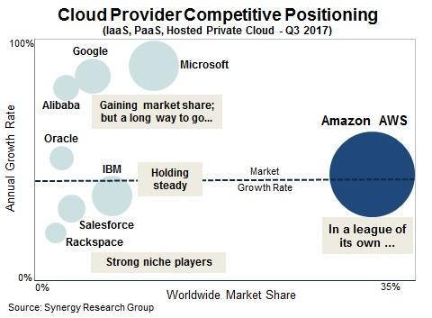
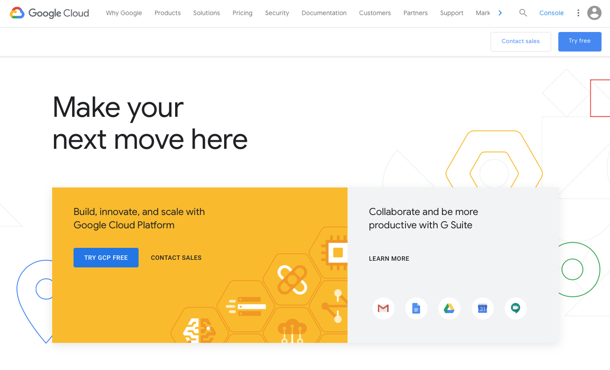
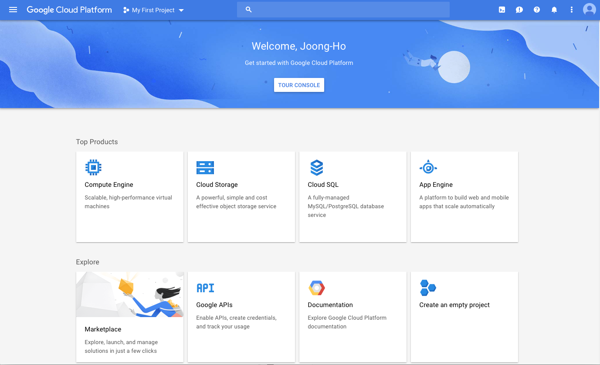
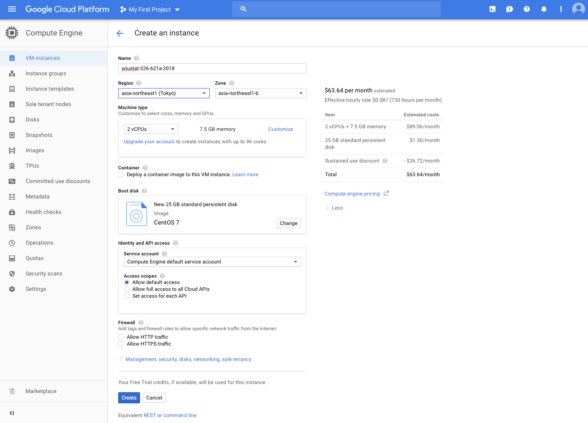
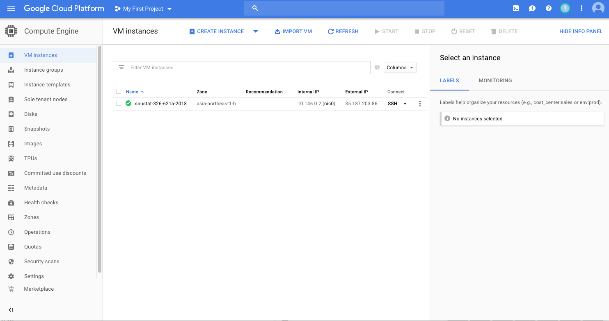
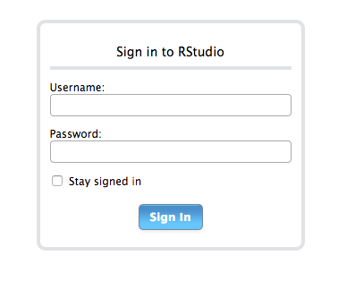
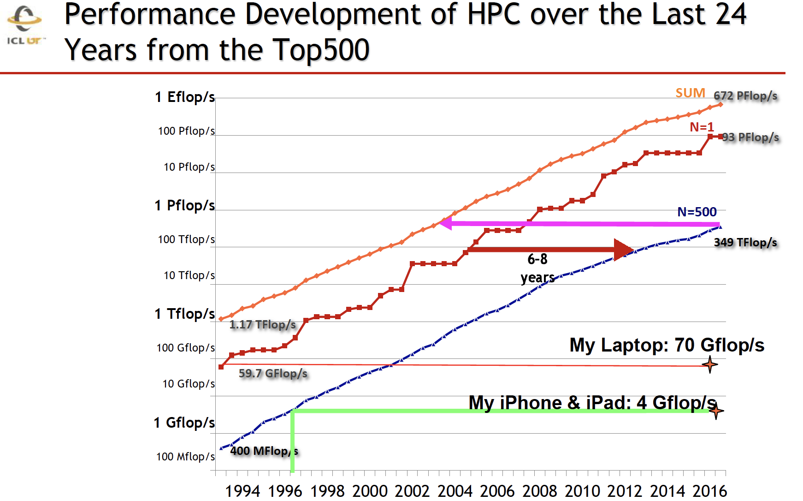

```{r setup, include=FALSE}
knitr::opts_chunk$set(echo = TRUE)
```

## Acknowledgment

This lecture note is based on [Dr. Hua Zhou](http://hua-zhou.github.io)'s 2018 Winter Statistical Computing course notes available at <http://hua-zhou.github.io/teaching/biostatm280-2018winter/index.html>.


## What is cloud computing

- Using a collection of remote servers for computation, data
storage/manipulation, etc.

- Pay for clock-cycles, storage, and network flow rather than hardware.

- Computing when you need it:
    - Scalable computing
    - Scalable storage

## It's not in cloud

<p align="center">
{width=400px}
{width=400px}
{width=400px}
{width=400px}
</p>


## Why cloud computing is so popular

- Scalability!

- Adapt to fluctuating demand:

    - Websites with fluctuating traffic
    
    - large corporations use much more computing during business hours than off-business hours

- Efficiency

    - Pay for what you need
    
    - No need for hardware maintenance
    
    - Less waiting for fixed compute-time jobs
        
## Why _we_ care about cloud computing

- Our computational demands often fluctuate dramatically.

- Grant resource management.
    - Old style: buy computer with grant X money, must use computer **only** for grant X research.  
    - New style: buy computing time for grant X research with grant X money.
    
- Massive computing when you need it
    - On the cloud you can run your job on 10,000 machines for one hour for the same price as running it on one machine for 10,000 hours!
    - Using AWS EC2 spot instances, this can be done for $700 an hour, and gets you super-computer performance.
    - It may be more compelling to know that you can get 8 cores
for around $0.27 an hour.

## Vendors

<p align="center">

</p>

There are many vendors out there. Good for customers (us). They all work similarly.  

- Amazon web services (AWS).  

- Google cloud platform (GCP).

- Microsoft Azure.

- IBM cloud.

We will demonstrate how to start using GCP.

## Using GCP Compute Engine: basic workflow

0. Set up GCP account.

0. Configure and launch VM instance(s).

0. Set up connection (SSH key).

0. Install softwares you need.

0. Run your jobs.

0. Transfer result.

0. Terminate instance(s).

## Step 0: set up GCP account

<p align="center">

</p>

- Go to <https://cloud.google.com>.

- Make use you sign in using your Google account. You may want to sign out your existing Google accounts and [create a new one](https://accounts.google.com/signup/v2/webcreateaccount?hl=en&flowName=GlifWebSignIn&flowEntry=SignUp) before next steps.

- If you click `Try it free` at <https://cloud.google.com> and fill out requisite information, you will get $300 credit which expires in 1 year. You do **not** need to use it for this course. But it's better to claim the credit **before** redeeming the coupon below.

- You will be asked for a name and email address.

- After email verification and redeeming the coupon, a project `My First Project` is created in GCP.

**GCP free trial**:

- Some resources are always free: 1 f1-micro VM instance, 30GB of standard persistent disk storage, etc.

- General pricing can be found on this [page](https://cloud.google.com/compute/pricing?hl=en_US&_ga=2.155132024.-1106292436.1515381586).

## Step 1: configure and launch a VM instance

- Go to GCP console, create a project.

<p align="center">

</p>

- Go to Compute Engine, click `CREATE INSTANCE`.

    - Give a meaningful name, e.g, `snustat-326_621a-2018`.

    - Choose `asia-northeast-b` zone.
    
    - Machine type: 2 vCPUs, 7.5GB memory should suffice for this course.
    
    - Boot disk: CentOS 7, standard persistent disk (or SSD) 25GB should sufficie for this course. 
    
    - These settings can be changed anytime. **Typical paradigm**: develop code using an inexpensive machine type and switch to a powerful one when running computation intensive tasks.
    
    - Click `Create`.
    
<p align="center">

</p>
    
- At the `VM Instances` page, you can see a list of all instances in your project and their IP addresses. We use the external IP address, e.g., `35.187.203.86`, for SSH connection.

- Note if we stop the instance and start again. The external IP address may change. To keep a fixed external IP address, go to `VPC network` then `External IP addresses` and make the desired external IP address `static` (vs ephemeral). Note that if no instance is using a `static` IP address, you will be charged for the idle `static` IP.
    
<p align="center">

</p>
    
## Step 2: set up SSH keys

There are several ways to connect to the VM instance you just created. Most often we want to be able to SSH into the VM instance from other machines, e.g., your own laptop. By default, VM instance only accept key authentication. So it's necessary to set up the SSH key first.

- Click the `SSH` button on `VM Instances` page will bring out a terminal in browser as super user, e.g., `johann_won` (your gmail account name).

- In that browser, you can set up your own SSH keys:
```{bash, eval = FALSE}
cd
mkdir .ssh
chmod go-rx .ssh/
cd .ssh
vi authorized_keys
```
Copy your public key to `authorized_keys` and set permission
```{bash, eval = FALSE}
chmod go-rwx authorized_keys
```

If you don't have a public key, then you may want try password authentication. To do this, edit `/etc/ssh/sshd_config` file by
```{bash, eval=FALSE}
sudo vi /etc/ssh/sshd_config
```
and uncomment the line
```
#PasswordAuthentication yes 
```
Don't forget to comment out the line
```
PasswordAuthentication no 
```
Then, add password to your account by
```{bash, eval=FALSE}
sudo password $(YOUR_GOOGLE_ACCOUNT_NAME)
```
Finally, restart the ssh daemon by
```{base, eval=FALSE}
sudo service sshd restart
```

- Now you should be able to connect to the VM instance from any machine with the matching private key:
```{bash, eval = FALSE}
ssh $(YOUR_GOOGLE_ACCOUNT_NAME)@35.187.203.86    ## actual ip address should be different
```

## Step 3: install software

`yum` is the default package management tool on CentOS. Most software can be installed via `sudo yum`. `sudo` executes a command as a superuser (or root).

### Install R/R Studio Server
    
-  Install [Extra Packages for Enterprise Linux](https://fedoraproject.org/wiki/EPEL) (if not yet)
```{bash, eval = FALSE}
sudo yum install epel-release -y
sudo yum update -y
```

- Install R (it takes a couple minutes)
```{bash, eval = FALSE}
sudo yum install R -y
```

- Install `wget`, which is a command line tool for downloading files from internet.
```{bash, eval = FALSE}
sudo yum install wget -y
```

- Download and install the most recent [R Studio Server](https://www.rstudio.com/products/rstudio/download-server/).
It is version 1.1.463 as of November 11, 2018.
```{bash, eval = FALSE}
wget https://download2.rstudio.org/rstudio-server-rhel-1.1.463-x86_64.rpm
sudo yum install rstudio-server-rhel-1.1.463-x86_64.rpm
rm rstudio-server-rhel-1.1.463-x86_64.rpm
```

- The R Studio service starts immediately. Let's check if it is running  properly by triggering the following command.
```{bash, eval = FALSE}
sudo systemctl status rstudio-server.service
```

- By default, port 8787 used by R Studio Server is blocked by VM firewall. On GCP console, go to `VPC network` and then `Firewall rules`, create a rule for R Studio Server (`tcp: 8787`), apply that rule to your VM instance.

- Now you should be able to access R Studio Server on the VM instance by pointing your browser to address `http://35.187.203.86:8787`.

<p align="center">
{width=400px}
</p>

    
### Set up a regular user

- Key authentication suffices for most applications.

- Unfortunately R Studio Server (open source edition) does not support key authentication. That implies if you want to use R Studio Server on the VM Instance, you need to enable username/password authentication.

- As super user e.g. `johann_won`, you can create a regular user, say `wonj`:
```{bash, eval = FALSE}
sudo useradd -m wonj
```
The `-m` option creates the home folder `/home/wonj`.

- You can set password for a user by
```{r, eval = FALSE}
sudo passwd wonj
```

- Now you should be able to log in the R Studio Server from browser `http://35.187.203.86:8787` using username `wonj` and corresponding password.

- To SSH into VM instance as the regular user `wonj`, you need to set up the key (similar to set up key for superuser).

- If you want to enable the regular user as a sudoer, add it into the `wheel` group:
```{bash, eval = FALSE}
su - johann_won
sudo usermod -aG wheel wonj
su - wonj
```

### Install R packages

- When installing R packages, it often fails because certain Linux libraries are absent. 

- Pay attention to the error messages, and install those libraries using `yum`. 

- E.g., try installing `tidyverse` may yield following errors
```{r, eval = FALSE}
ERROR: dependencies ‘httr’, ‘rvest’, ‘xml2’ are not available for package ‘tidyverse’
* removing ‘/home/wonj/R/x86_64-redhat-linux-gnu-library/3.4/tidyverse’
```
You can install these Linux dependencies `curl`, `openssl`, and `libxml2` by:
```{bash, eval = FALSE}
sudo yum install curl curl-devel -y
sudo yum install openssl openssl-devel -y
sudo yum install libxml2 libxml2-devel -y
```

### Install Git

- Install Git on VM instance:
```{bash, eval = FALSE}
sudo yum install git -y
```

- For smooth Gitting, you need to put the private key matching the public key in your GitHub account in the `~/.ssh` folder on the VM instance.

- Now you can `git clone` any repo to the VM instance to start working on a project. E.g.,
```{bash, eval = FALSE}
git clone https://github.com/snu-stat/stat326_621a-2018-hw2
```


## Step 4: run your jobs

- Now you have R and R Studio on the VM instance. 

- Simpliest way to synchronize your project files across machines is Git, e.g.,
```{bash, eval = FALSE}
git clone https://github.com/snu-stat/stat326_621a-2018-hw2
```

- Set up and run your jobs as usual.

- You can check CPU usage on the GCP console.

- You can set notification when CPU usage falls below a threshold (so you know the job is done).

## Step 5: transfer results

- Transfer results as usual: scp, sftp, Git.

## Step 6: terminate instance(s)

- Don't forget to terminate your instance(s). You'll get charged!

## Go forth and use the cloud

- Using cloud (AWS, Azure, GCP, ...) is easy.

- Easy to launch cluster instances or other heavily customized instances (SQL server, BigQuery, ML engine, Genomics, ...).

- Massive computing at your fingertips. 

    - Amazon EC2 [P2 instances](https://aws.amazon.com/ec2/instance-types/p2) offer on a single virtual machine 16 GPUs, with 40,000 parallel processing cores, and 732 GB memory, yielding 70 teraflops of single precision floating point performance or 23 teraflops of double-precision. 

    <p align="center">
    
    </p>
    
    - GCP recently announced [TPU (tensor processing units)](https://cloud.google.com/tpu/) for deep learning. Each Cloud TPU offers up to 180 teraflops of computing performance as well as 64 gigabytes of ultra-high-bandwidth memory.

    <p align="center">
    
    </p>

    - To put it in perspective, 180 teraflops is equivalent to the most powerful high performance cluster (HPC) in 2005, according to following [slide](https://www.samsi.info/wp-content/uploads/2017/02/SAMSI-0217_Dongarra.pdf) by Jack Dongarra.
    
    <p align="center">
    {width=640}
    </p>
