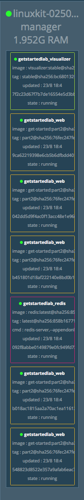
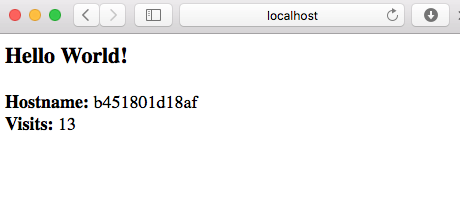

```{r setup, include=FALSE}
options(width = 160)
knitr::opts_chunk$set(echo = TRUE)
Sys.setenv(DOCKERID="rickdeckard")
```

## What is Docker

- It took us considerable efforts to set up a GCP Compute Engine instance with a full stack of tools we need: CentOS, Linux libraries, R, R Studio, tidyverse, Shiny server, ...

- We can save the configuration as an image (or snapshot) so we don't have to re-configure each time using GCP. 

- In a more complex (buisiness) environment, different apps may have different or conflicting dependencies, making configuration and deployment an excessive overhead. 

- Alternative approach: each app, together with its computing enrivonment and database, can be **containerized**.

- **Paradigm**: develop apps locally (with potentially different toolchain), deploy (at scale) anywhere.

<p align="center">
{width=300px}
</p>

## Why do _we_ care?

Scenario 1: You have a Windows machine, but want to learn the open source toolchains on Linux.

Scenario 2: Your paper gets rejected, because the reviewer wants comparison with an existing method. But software for existing method only runs on Linux. 

Scenario 3: You develop a piece of software. You want to debug/test on different versions of R, on different OS (MacOS, Linux, Windows).

Scenario 4: Reproducible research. Hardware and software evolve fast. Simulation results in research papers are often hard to reproduce due to the changing computing environment. We can use Docker to containerize a simulation experiment (specific versions of OS and software), which can reproduce same results in any future moment.

## Learning objectives

- Be conversant with the container technology.

- Understand the role containers play in the development and deployment process.

- Master basic Docker usage.


## Tutorial

We will follow the tutorial [Get started with Docker](https://docs.docker.com/get-started/) to:

- **containerize** a Python web app.

- run the **container**.

- run the container as a **service**.

- run interrelated services as a **stack**.

- deploy a stack to cloud.

```{bash, echo = FALSE, include = FALSE, error = TRUE}
# remove: all stopped containers, all networks not used by at least one container, all images without at least one container associated to them, all build cache
docker system prune -a -f
```

### Installation

[Download](https://docs.docker.com/install/) and install the Docker CE (Community Edition) on your computer.


### Part 2: containerize a web app

We use Docker to develop an app that serves a webpage.

#### Essential components

- [`requirements.txt`](./requirements.txt) lists the Python dependencies:
```{bash}
cat requirements.txt
```

- [`app.py`](./app.py) is the Python code for serving a webpage.
```{bash}
cat app.py
```

- [`Dockerfile`](./Dockerfile) instructs Docker how to put things together in a container:
```{bash}
cat Dockerfile
```
See [python on Docker Hub](https://hub.docker.com/_/python/) for details on the `python:2.7-slim` image.

See [Dockerfile reference](https://docs.docker.com/engine/reference/builder/) for commands in Dockerfile.

#### Build the app

Build the image:
```{bash}
docker build -t friendlyhello .
```
Display the image:
```{bash}
docker image ls
```

#### Run the app

Run the app by
```{bash eval=FALSE}
docker run -p 4000:80 friendlyhello
```
or in detached mode
```{bash}
docker run -d -p 4000:80 friendlyhello
```
`-p 4000:80` maps port 80 of the container to port 4000 of host.

Display the container:
```{bash}
docker container ls
```

We now should be able to check the webpage by pointing browser to `$HOSTIP:4000`.

To stop the container, issue:
```{bash, eval = FALSE}
docker container stop <CONTAINER_ID>
```
To kill all containers
```{bash, error = TRUE}
docker container kill $(docker container ls -a -q)
```
then remove them
```{bash, error = TRUE}
docker container rm $(docker container ls -a -q)
```

#### Share the image

To demonstrate the portability of what we just created, let’s upload our built image and run it somewhere else. After all, you need to know how to push to registries when you want to deploy containers to production.

A registry is a collection of repositories, and a repository is a collection of images—sort of like a GitHub repository, except the code is already built. An account on a registry can create many repositories. 

We use Docker’s public registry because it’s free and pre-configured (default by `docker` CLI).

- Log in with your Docker ID:
   Sign up for one at [hub.docker.com](https://hub.docker.com/). Make note of your username. 
   ```{bash eval=FALSE}
   docker login
   ```

- Tag the `friendlyhello` image:
    ```{bash eval=FALSE}
    docker tag friendlyhello $DOCKERID/get-started:part2
    ```
    
- Upload the tagged image to registry:
    ```{bash, eval = FALSE}
    docker push $DOCKERID/get-started:part2
    ```
    
- Now the image is up on [Docker Hub registry](https://hub.docker.com/r/rickdeckard/get-started/). We can run image (on any machine with Docker installed) from the registry:
    ```{bash, eval = FALSE}
    docker run -d -p 4000:80 $DOCKERID/get-started:part2
    ```

### Part 3: run replicates of a container as service

**Services** are really just "containers in production." A service only runs one image, but it codifies the way that image runs—what ports it should use, how many replicas of the container should run so the service has the capacity it needs, and so on. 

The following [`docker-compose.yml`](./docker-compose.yml) specifies:

- Pull the image `$DOCKERID/get-started:part2`.

- Run 5 instances of that image as a service called `web`, limiting each one to use, at most, 10% of the CPU (across all cores), and 50MB of RAM.

- Immediately restart containers if one fails.

- Map port 4000 on the host to `web`’s port 80.

- Instruct `web`’s containers to share port 80 via a load-balanced network called webnet. (Internally, the containers themselves publish to `web`’s port 80 at an ephemeral port.)

- Define the `webnet` network with the default settings (which is a load-balanced overlay network).

```{bash}
cat docker-compose.yml
```

See [Docker Compose reference](https://docs.docker.com/compose/compose-file/) for commands in Docker Compose.

Run a new load-balanced app in a swarm mode:
```{bash}
docker swarm init
docker stack deploy -c docker-compose.yml getstartedlab
```

A swarm is a group of machines that are running Docker and joined into a cluster. After that has happened, you continue to run the Docker commands you’re used to, but now they are executed on a cluster by a swarm manager. The machines in a swarm can be physical or virtual. After joining a swarm, they are referred to as nodes.

In this example, we run swarm on a single local machine.


List the service:
```{bash}
docker service ls
```
List the tasks for your service:
```{bash}
docker service ps getstartedlab_web
```

To take down the service and swarm:
```{bash}
docker stack rm getstartedlab
docker swarm leave --force
```

### Part 5: run interrelated services as a stack

A **stack** is a group of interrelated services that share dependencies, and can be orchestrated and scaled together. A single stack is capable of defining and coordinating the functionality of an entire application.

Here we want to add two more services: a `visualizer` for visualizing services and a `redis` database for counting webpage visits. 

The only thing we need to do is to update the [docker-composer.yml](./docker-composer.yml) file. Let's name the new file [docker-compose-stack.yml](./docker-compose-stack1.yml) in order to avoid confusion:
```{bash, eval=FALSE}
cat docker-compose-stack.yml
```
```{bash, echo=FALSE}
cat docker-compose-stack1.yml
```
Then deploy
```{bash}
docker swarm init
```

```{bash, eval=FALSE}
docker stack deploy -c docker-compose-stack.yml getstartedlab2
```
```{bash, echo=FALSE}
docker stack deploy -c docker-compose-stack1.yml getstartedlab2
```

List the service:
```{bash}
docker service ls
```
List the tasks for your service:
```{bash}
docker service ps getstartedlab2_web
```

Now we can check the new webpage at `$HOSTIP:4000` 

<p align="center">
{width=400px}
</p>

and the visualizer at `$HOSTIP:8080` in browser.

<p align="center">
{width=173px, height=1023px}
</p>

#### Upgrade your service: persist the data

1. Modify [docker-compose-stack.yml](./docker-compose-stack.yml) as:
```{bash}
cat docker-compose-stack.yml
```
    - Redis has an official image in the Docker library and has been granted the short image name of just `redis`.
    - `redis` always runs on the manager, so it’s always using the same filesystem.
    - `redis` accesses an arbitrary directory in the host’s file system as `/data` inside the container, which is where Redis stores data.
    - The volume you created that lets the container access `./data` (on the host) as `/data` (inside the Redis container). While containers come and go, the files stored on `./data` on the specified host persists, enabling continuity.


1. Create a `./data` subdirectory:
```{bash eval=FALSE}
mkdir ./data
```

1. Run docker stack deploy one more time.
```{bash}
docker stack deploy -c docker-compose-stack.yml getstartedlab2
```

1. Verify that the three services are running as expected.
```{bash}
docker service ls
```

1. Check the web page at one of your nodes, and take a look at the results of the visitor counter, which is now live and storing information on Redis.

<p align="center">
{width=400px}
</p>


#### Cleanup

To take down the service and swarm:
```{bash}
docker stack rm getstartedlab2
docker swarm leave --force
```

### Deploy a stack to GCP

Option 1: Create a container-optimized instance in GCP Compute Engine.

Option 2: On any GCP instance, install Docker and run a container. 

- On CentOS, [install Docker CE](https://docs.docker.com/install/linux/docker-ce/centos/) by:
```{bash, eval = FALSE}
# install yum-config-manager
sudo yum install -y yum-utils 
sudo yum install -y yum-config-manager device-mapper-persistent-data lvm2
# add Docker CE repo for CentOS
sudo yum-config-manager --add-repo https://download.docker.com/linux/centos/docker-ce.repo
## install Docker CE
sudo yum install docker-ce
```

- Run docker:
```{bash, eval=FALSE}
sudo systemctl start docker
sudo docker run hello-world
}

- Run container:
```{bash, eval = FALSE}
sudo docker run -d -p 4000:80 rickdeckard/get-started:part2
```

- To run the web service, copy `docker-compose.yml` to the server and run
```{bash, eval = FALSE}
sudo docker swarm init
sudo docker stack deploy -c docker-compose.yml getstartedlab
```

- To run the stack with web+visualizer+redis, copy `docker-compose-stack.yml` to the server and run
```{bash, eval = FALSE}
sudo docker swarm init
sudo docker stack deploy -c docker-compose-stack.yml getstartedlab
``` 

- Don't forget to unblock ports used by the container from the VM firewall. On GCP console, go to `VPC network` and then `Firewall rules`, create rules for the web server (`tcp: 4000`), visualizer (`tcp: 8080`), and Redis (`tcp: 6379`). Apply those rules to your VM instance.

- To take down the service and swarm:
```{bash, eval = FALSE}
sudo docker stack rm getstartedlab
sudo docker swarm leave --force
```

### Multi-container, multi-machine applications

See [part 4](https://docs.docker.com/get-started/part4/) of the tutorial.

### Stack: heterogenous containers, multi-machine applications

See [part 5](https://docs.docker.com/get-started/part5/) of the tutorial.

### Deploy stack to AWS/Azure

See [part 6](https://docs.docker.com/get-started/part6/) of the tutorial.

## Scenario: Run a Linux container interactively

Run [CentOS](https://hub.docker.com/_/centos/) interactively (as `root`):
```{bash, eval = FALSE}
docker run -ti --rm centos:latest
```
`-i` means interactive. `-t` allocates a pseudo-tty. `--rm` removes the container when it exits.

Run [Ubuntu](https://hub.docker.com/_/ubuntu/) interactively (as `root`):
```{bash, eval = FALSE}
docker run -ti --rm ubuntu:latest
```

## Scenario: Run Linux+R on your MacOS/Windows laptop

- Launch R interactively:
```{bash, eval = FALSE}
docker run -ti --rm -v ~/Desktop:/Desktop r-base
```
It downloads, builds, and runs a Docker image called [`r-base`](https://hub.docker.com/r/_/r-base/) (Debian + R). `-v` maps a folder on host to a folder in the container.

- Run a bash session on the container:
```{bash, eval = FALSE}
docker run -ti --rm r-base /usr/bin/bash
```

- Run R in batch mode. Suppose current folder contains an R script `autoSim.R`, which we want to run:
```{bash, eval = FALSE}
docker run -ti --rm -v "$PWD":/home/docker -w /home/docker -u docker r-base Rscript autoSim.R
```
`-w` specifies the working directory. `-u` specifies the user.


### Recap: docker survival commands

Part 1:
```{bash, eval = FALSE}
## List Docker CLI commands
docker
docker container --help

## Display Docker version and info
docker --version
docker version
docker info

## Excecute Docker image
docker run hello-world

## List Docker images
docker image ls

## List Docker containers (running, all, all in quiet mode)
docker container ls
docker container ls --all
docker container ls -a -q
```

Part 2:
```{bash, eval = FALSE}
docker build -t friendlyhello .  # Create image using this directory's Dockerfile
docker run -p 4000:80 friendlyhello  # Run "friendlyname" mapping port 4000 to 80
docker run -d -p 4000:80 friendlyhello         # Same thing, but in detached mode
docker container ls                                # List all running containers
docker container ls -a             # List all containers, even those not running
docker container stop <hash>           # Gracefully stop the specified container
docker container kill <hash>         # Force shutdown of the specified container
docker container rm <hash>        # Remove specified container from this machine
docker container rm $(docker container ls -a -q)         # Remove all containers
docker image ls -a                             # List all images on this machine
docker image rm <image id>            # Remove specified image from this machine
docker image rm $(docker image ls -a -q)   # Remove all images from this machine
docker login             # Log in this CLI session using your Docker credentials
docker tag <image> username/repository:tag  # Tag <image> for upload to registry
docker push username/repository:tag            # Upload tagged image to registry
docker run username/repository:tag                   # Run image from a registry
```

Part 3:
```{bash, eval = FALSE}
docker stack ls                                            # List stacks or apps
docker stack deploy -c <composefile> <appname>  # Run the specified Compose file
docker service ls                 # List running services associated with an app
docker service ps <service>                  # List tasks associated with an app
docker inspect <task or container>                   # Inspect task or container
docker container ls -q                                      # List container IDs
docker stack rm <appname>                             # Tear down an application
docker swarm leave --force      # Take down a single node swarm from the manager
```
