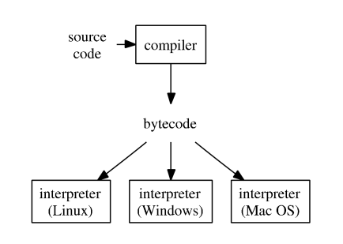

```{r setup, include=FALSE}
knitr::opts_chunk$set(echo = TRUE)
options(width = 120)
```

## Acknowledgment

This lecture note is based on [Dr. Hua Zhou](http://hua-zhou.github.io)'s 2018 Winter Statistical Computing course notes available at <http://hua-zhou.github.io/teaching/biostatm280-2018winter/index.html>.


```{r}
sessionInfo()
```

## Typical development cycle for computational statistics

1. Scientific planning: What experiments would verify/invalidate our hypotheses? What parameter settings should we consider?

0. Code planning: What does the code need to do? How will the code fit together? What functions will be used? What are their inputs/outputs? etc.

0. Implementation:

    1. Prototype functions, classes, partial documentation, etc.
    
    2. Write unit tests
    
    3. Implement code, run unit tests, debug
    
    4. Broader testing, more debugging
    
    5. Profile code, identify bottlenecks
    
    6. Optimize code
    
0. Conduct experiments.

0. Full documentation.

## Bytecode compilation

- After profiling, what to do to improve performance?

    1. Ask: Are there obvious speedups? Are things being computed unnecessarily? Are you using a `data.frame` where you should be using a `matrix` etc.  
    
    2. Look up your problem (e.g., search for "`lapply` slow" or "speeding up `lapply`" etc.)
    
    3. Try the just-in-time (JIT) compiler.
    
    4. Consider re-writing some or all of the code in a compiled language (e.g., C/C++).
    
    5. Try parallelization.

- R typical execution:

<p align="center">
{width=400px}
</p>

- R 2.13.0 introduced a byte code compiler (`compiler` package by Luke Tierney) which can increase the speed of some code. Using the compiler is an easy way to get improvements in speed. 


### Example: summing a vector

Brute-force `for` loop for summing a vector:
```{r}
sum_r <- function(x) {
  sumx <- 0.0
  for (i in 1:length(x)) {
    sumx <- sumx + x[i]
  }
  return(sumx)
}
sum_r
```
Run the code on 1,000,000 elements:
```{r}
library(microbenchmark)
library(ggplot2)

x = seq(from = 0, to = 100, by = 0.0001)
microbenchmark(sum_r(x))
```

Let's compile the function into bytecode `sum_rc` and benchmark again:
```{r}
library(compiler)
sum_rc <- cmpfun(sum_r)
sum_rc
```
Benchmark again:
```{r}
microbenchmark(sum_r(x), sum_rc(x))
```
**Surprisingly, compiling into bytecode does not help at all!** Following code shows that the function `sum_r` is already compiled into bytecode before execution.
```{r}
sum_r
```

Let's turn off JIT (just-in-time compilation), re-define the (same) `sum_r` function, and benchmark again:
```{r}
enableJIT(0) # set JIT leval to 0
sum_r <- function(x) {
  sumx <- 0.0
  for (i in 1:length(x)) {
    sumx <- sumx + x[i]
  }
  return(sumx)
}
microbenchmark(sum_r(x))
```
Now we witness the slowness of the un-compiled `sum_r`.

Documentation of `enableJIT`:  

> enableJIT enables or disables just-in-time (JIT) compilation. JIT is disabled if the argument is 0. If level is 1 then larger closures are compiled before their first use. If level is 2, then some small closures are also compiled before their second use. If level is 3 then in addition all top level loops are compiled before they are executed. JIT level 3 requires the compiler option optimize to be 2 or 3. The JIT level can also be selected by starting R with the environment variable R_ENABLE_JIT set to one of these values. Calling enableJIT with a negative argument returns the current JIT level. The default JIT level is 3.

Since R 3.4.0 (Apr 2017), the JIT bytecode compiler is enabled by default at its level 3. 

If you create a package, then you automatically compile the package on installation by adding
```{r, eval = FALSE}
ByteCompile: true
```
to the `DESCRIPTION` file.

[Matlab](https://www.mathworks.com/products/matlab.html) has employed JIT technology since **2002** and [Julia](https://julialang.org) is designed totally based on JIT. R finally is on the same boat.

## Rcpp

Learning sources:  
- _Advanced R_: <http://adv-r.had.co.nz/Rcpp.html>


JIT compiler compiles R code into bytecode, which is translated to machine code by interpreter during execution. A low-level language such as C, C++, and Fortran is compiled into machine code directly, yielding the maximum efficiency.

### Use `cppFunction`

`Rcpp` package provides a convenient way to embed C++ code in R code.
```{r}
library(Rcpp)

cppFunction('double sum_c(NumericVector x) {
  int n = x.size();
  double total = 0;
  for(int i = 0; i < n; ++i) {
    total += x[i];
  }
  return total;
}')
sum_c
```
Benchmark (1) compiled C++ function `sum_c` together with (2) R function `sum_r`, (3) compiled R function `sum_rc`, and (4) the `sum` function in base R:
```{r}
mbm <- microbenchmark(sum_r(x), sum_rc(x), sum_c(x), sum(x))
mbm
autoplot(mbm)
```

**Remember we turned off JIT by `enableGIT(0)` earlier.**

### Use `sourceCpp`

In realistic projects,  we write standalone C++ files and then source them into R using `sourceCpp()`. For example, consider [`sum.cpp`](./sum.cpp):
```{bash}
cat sum.cpp
```

`Rcpp::sourceCpp()` parses the specified C++ file or source code:
```{r}
sourceCpp("sum.cpp")
sum_c
```

## Parallel computing

- Fact: base R is single-threaded. Even you request a fancy instance with 96 vCPUs, running R code is just using 1/96th of its power.

- To perform multi-core computation in R:

    1. Option 1: Manually run multiple R sessions.

    2. Option 2: Make multiple `system("Rscript")` calls. Typically automated
by a scripting language (Python, Perl, shell script) or within R.

    3. Option 3: Use package `parallel`. 

- `parallel` package in R.

    - Authors: Brian Ripley, Luke Tieney, Simon Urbanek.
    
    - Included in base R since 2.14.0 (2011).
    
    - Based on the `snow` (Luke Tierney) and `multicore` (Simon Urbanek) packages.  
    
    - To find the number of cores:
    ```{r}
    library(parallel)
    detectCores()
    ```

### Simulation example
    
Let's re-visit the simulation example considered in earlier lecture and HW1:

We have a "new" method that estimates the population mean by averaging the observations indexed by prime numbers.
```{r}
## check if a given integer is prime
isPrime = function(n) {
  if (n <= 3) {
    return (TRUE)
  }
  if (any((n %% 2:floor(sqrt(n))) == 0)) {
    return (FALSE)
  }
  return (TRUE)
}

## estimate mean only using observation with prime indices
estMeanPrimes = function(x) {
  n <- length(x)
  ind <- sapply(1:n, isPrime)
  return (mean(x[ind]))
}
```
We want to compare our method to the traditional sample average estimator by simulation studies. 
```{r}
## compare methods: sample avg and prime-indexed avg
compare_methods <- function(dist = "gaussian", n = 100, reps = 100, seed = 123) {
  # set seed according to command argument `seed`
  set.seed(seed)
  
  # preallocate space to store estimators
  msePrimeAvg <- 0.0
  mseSamplAvg <- 0.0
  # loop over simulation replicates
  for (r in 1:reps) {
    # simulate data according to command arguments `n` and `distr`
    if (dist == "gaussian") {
      x = rnorm(n)
    } else if (dist == "t1") {
      x = rcauchy(n)
    } else if (dist == "t5") {
      x = rt(n, 5)
    } else {
      stop(paste("unrecognized dist: ", dist))
    }
    # prime indexed mean estimator and classical sample average estimator
    msePrimeAvg <- msePrimeAvg + estMeanPrimes(x)^2 
    mseSamplAvg <- mseSamplAvg + mean(x)^2
  }
  mseSamplAvg <- mseSamplAvg / reps
  msePrimeAvg <- msePrimeAvg / reps
  return(c(mseSamplAvg, msePrimeAvg))
}
```

### Serial code

We need to loop over 3 generative models (`distTypes`) and 20 samples sizes (`nVals`). That are 60 "embarssingly parallel" tasks.
```{r}
seed = 280
reps = 500
nVals = seq(100, 1000, by = 50)
distTypes = c("gaussian", "t5", "t1")
```
This is the serial code that double-loop over combinations of `distTypes` and `nVals`:
```{r}
## simulation study with combination of generative model `dist` and
## sample size `n` (serial code)
simres1 = matrix(0.0, nrow = 2 * length(nVals), ncol = length(distTypes))
i = 1 # entry index
system.time(
  for (dist in distTypes) {
    for (n in nVals) {
      simres1[i:(i + 1)] = compare_methods(dist, n, reps, seed)
      i <- i + 2
    }
  }
)
simres1
```

### Using `mcmapply`

Run the same task using `mcmapply` function (parallel analog of `mapply`) in the `parallel` package:
```{r}
## simulation study with combination of generative model `dist` and
## sample size `n` (parallel code using mcmapply)
library(parallel)
system.time({
  simres2 <- mcmapply(compare_methods, 
                      rep(distTypes, each = length(nVals), times = 1),
                      rep(nVals, each = 1, times = length(distTypes)),
                      reps, 
                      seed,
                      mc.cores = 4)
})
simres2 <- matrix(unlist(simres2), ncol = length(distTypes))
simres2
```

- We see roughly 2x-3x speedup with `mc.cores=4`.

- `mcmapply`, `mclapply` and related functions rely on the forking capability of POSIX operating systems (e.g. Linux, MacOS) and is **not** available in Windows.

- `parLapply`, `parApply`, `parCapply`, `parRapply`, `clusterApply`, `clusterMap`, and related
functions create a cluster of workers based on either socket (default) or forking. Socket is available on all platforms: Linux, MacOS, and Windows.

### Using `clusterMap`

The same simulation example using `clusterMap` function:  

```{r, eval = TRUE}
# Windows: use makePSOCKcluster()   
cl <- makeCluster(getOption("cl.cores", 4))
clusterExport(cl, c("isPrime", "estMeanPrimes", "compare_methods"))
system.time({
  simres3 <- clusterMap(cl, compare_methods,
                        rep(distTypes, each = length(nVals), times = 1),
                        rep(nVals, each = 1, times = length(distTypes)),
                        reps,
                        seed,
                        .scheduling = "dynamic")
})
simres3 <- matrix(unlist(simres3), ncol = length(distTypes))
stopCluster(cl)
simres3
```

-  Again, we see roughly 2x-3x speedup by using 4 cores.

- `clusterExport` copies environment of master to slaves.

-  It is also possible to distribute computation over a network of computers ("cluster").

## Examples of Embarassingly Parallel Tasks in Statistical Computing

- Bootstrapping
- Cross-validation
- Fitting multiple regression models

## Package development

Learning resources:  
- Book _[R Packages_ ](http://r-pkgs.had.co.nz)by Hadley Wickham  
- RStudio tutorial: <https://support.rstudio.com/hc/en-us/articles/200486488-Developing-Packages-with-RStudio>

